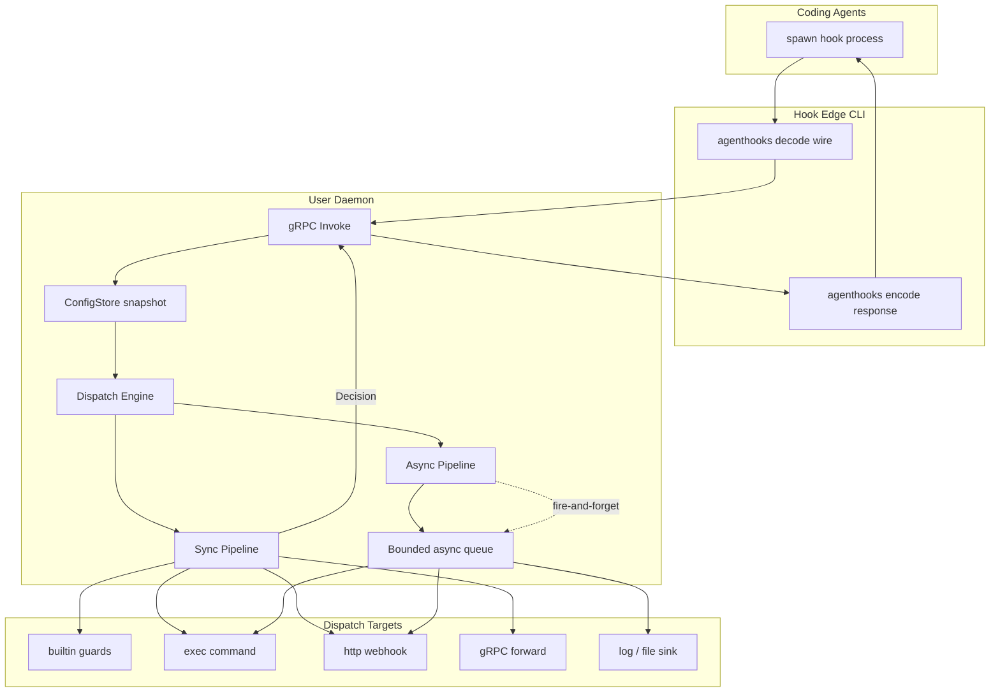
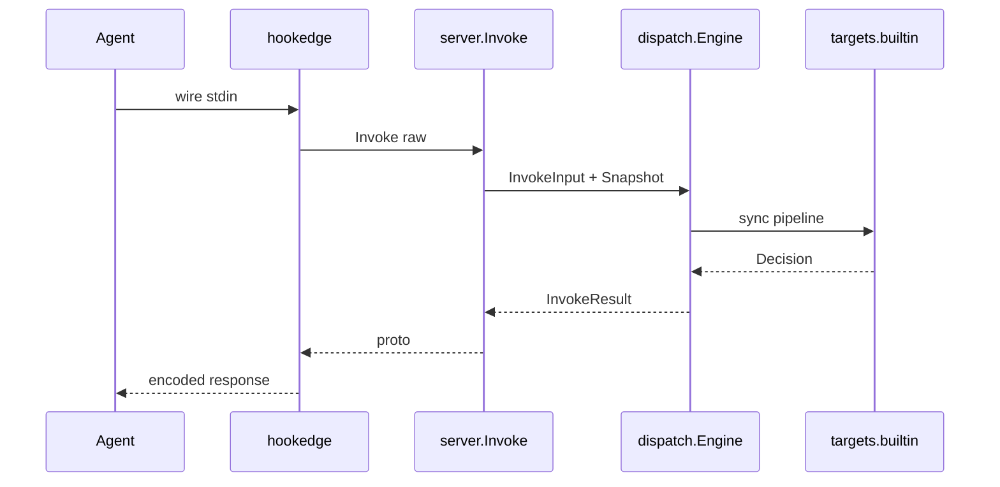
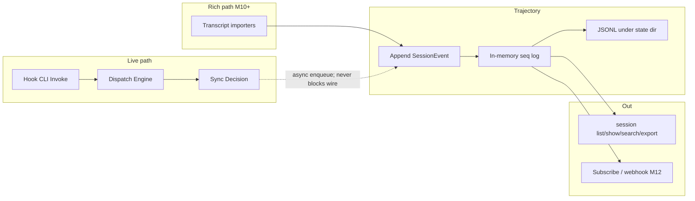

# agentd — Design

A user-level daemon that proxies, guards, and observes coding-agent hooks for Claude Code, Cursor, Codex, Gemini CLI, OpenCode, and Kimi Code. Built on [agenthooks](https://github.com/speakeasy-api/agenthooks).

Contributor and protobuf rules: [AGENTS.md](./AGENTS.md).

---

## 0. Goals

| Goal | Approach |
|------|----------|
| One hook logic, all agents | Thin CLI + agenthooks wire; daemon owns policy |
| Low latency on hot path | In-memory config snapshot; zero disk I/O per `Invoke` |
| Sync + async hooks | Dispatch Engine with hybrid modes |
| Safe defaults | Declarative guards; fail-closed policy option |
| Cross-platform | gRPC over Unix socket / Windows named pipe |
| Cross-agent trajectory (post-v1) | Opt-in append-only session ledger + transcript import — §14 / M9+ |

**Decisions:**

- One daemon per user (shared socket; per-project config via `.agentd.yaml`)
- Guards and dispatch via declarative YAML
- Daemon writes runtime overlay only (`$XDG_STATE_HOME/agentd/runtime.yaml`)
- Hook CLI: decode/encode only; all routing in daemon
- Trajectory (when enabled) is async side channel — never blocks wire encode; default off (PII)

---

## 1. Architecture



Agents invoke the hook CLI (`agentd hook run|notify|serve` in docs; install-generated configs use hidden `agentd agenthooks …` — same wire path). Hook CLI decode/encodes wire (agenthooks). **Dispatch Engine** routes sync (agent waits), async (telemetry), or hybrid.

### Process roles

| Process | Role | Lifecycle |
|---------|------|-----------|
| **Daemon** | gRPC server, Dispatch, guards, ConfigStore, async queue | One per user |
| **Hook CLI** | Wire decode/encode; single gRPC `Invoke` | Process-per-event |
| **Mgmt CLI** | start/stop/status/install/config | Short-lived |

### agenthooks integration

**Why `hook` and `agenthooks`?** `agentd install` delegates to `github.com/speakeasy-api/agenthooks/install`. That library renders provider hook settings with argv `agentd agenthooks run|notify|serve --provider=…` (its install sentinel). Docs and manual setup use the public `agentd hook …` commands instead. Both names are thin Cobra wrappers over the same `hookedge` path (`cmd/hook.go`); `agenthooks` is `Hidden` so generated configs keep working without cluttering `--help`.

1. **Hook CLI** (public):
   ```
   agentd hook run --provider=claude-code
   agentd hook run --provider=cursor --argv-payload
   agentd hook notify --provider=codex
   ```
   Wire decode/encode only; policy lives in the daemon.

2. **Install argv** — `install.Run` sets `Manifest.Command` to the absolute path of the `agentd` binary only; agenthooks/install appends `agenthooks run|serve|notify --provider=…` per hook kind. Generated files (e.g. `.claude/settings.json`, `.opencode/plugin/agenthooks.ts`) therefore call `agenthooks`, not `hook`. OpenCode shims spawn `agentd agenthooks serve --provider=opencode`; the hidden `serve` subcommand defaults `--provider` to `opencode` when omitted.

3. **Daemon** owns `*agenthooks.Runner` for `builtin` target:
   - Guards → sync `builtin`
   - Observers → async `builtin` with `observe: true`
   - `Runner.Decide(ctx, typed)` on sync path
   - Forward targets in `internal/dispatch/targets/`

4. **OpenCode serve** — `agentd hook serve` (or install’s `agenthooks serve`) holds stdio; each NDJSON frame → gRPC `Invoke`; session mutex in daemon.

5. **Providers:** `claude-code`, `cursor`, `codex`, `gemini`, `opencode`, `kimicode` (+ variants).

---

## 1.5 Hot paths

Three traces for reading code and reviewing PRs. Entry points only — no implementation paste.

### invoke_sync

Blocking hook: agent waits for decision before continuing.



Flow: `hook run|serve` → hookedge decode → gRPC `HookService.Invoke` → `dispatch.Engine.Invoke` with `config.Snapshot` from `Store.Current()` → route match → sync targets folded with `first_conclusive` (builtin guards via `Runner.Decide`) → decision proto → encode.

Policy `fail_closed` denies on guard/dispatch errors. Sync budget from `dispatch.SyncBudget` (`timeout.go`) — must fit provider hook timeout.

### config_reload

Config changes without blocking Invoke.

Flow: fsnotify on user/project/runtime YAML → debounced reload goroutine in `config.Store` → merge layers → `Compile` → atomic pointer swap. Hot path reads `Store.Current()` only — zero disk I/O per Invoke.

Daemon `SIGHUP` or runtime overlay write triggers reload; daemon does not compile config itself.

### async_side

Telemetry and observers; never blocks wire response.

Flow: `parallel` / `after_sync` / `async_only` modes → `Queue.Enqueue` (non-blocking; drops when full per `on_overflow`) → worker pool → async targets (log, file, http, exec, grpc). Overflow increments Status drop counter.

When `trajectory.enabled`, `HookService.Invoke` also enqueues session ledger records (non-blocking; separate bounded queue; JSONL persist async). Overflow increments `trajectory_dropped_count` on Status.

Sync pipeline returns before async workers finish. Async failure does not change sync decision.

### Package tags

| Package | Hot path | Role |
|---------|----------|------|
| `internal/hookedge` | `invoke_sync` | Provider codecs + wire I/O |
| `internal/server` | `invoke_sync` | Thin gRPC mapping to Engine / Snapshot |
| `internal/dispatch` | `invoke_sync`, `async_side` | Route match, Engine, queue, session lock |
| `internal/dispatch/targets` | `invoke_sync`, `async_side` | Sync/Async target adapters via factory |
| `internal/decision` | `invoke_sync` | proto↔agenthooks Decision |
| `internal/guard` | `invoke_sync` | secrets/shell/mcp/paths checks |
| `internal/config` | `config_reload` | Merge/compile; hot path reads Snapshot only |
| `internal/trajectory` | `async_side` | Session ledger append, persist, Hub, replay/fork |
| `internal/provider` | `other` | Canonical ids; Invoke uses `FromProto`, CLI uses `Parse` |

---

## 2. Hook Dispatch Engine

Central router with two axes:

1. **Sync pipeline** — affects agent response (deny/ask/allow/context); must fit provider timeout.
2. **Async pipeline** — audit, metrics, webhooks; never blocks wire response.

### Dispatch modes

| Mode | Behavior | Use when |
|------|----------|----------|
| `sync_only` | Sync chain → decision → encode | Blocking hooks |
| `async_only` | No decision; async only; no-op wire | Telemetry, notify |
| `parallel` | Sync + async start together; async does not block | Guard + audit |
| `after_sync` | Async after sync decision with outcome | Audit with deny/allow context |
| `sync_then_async` | Alias for `after_sync` | Default hybrid for blocking events |

**Defaults by kind** (override in config):

```yaml
dispatch_defaults:
  tool.pre:         { mode: parallel,        blocking: true }
  prompt.submitted: { mode: sync_only,        blocking: true }
  agent.stop:       { mode: sync_then_async, blocking: true }
  tool.post:        { mode: parallel,        blocking: false }
  notification:     { mode: async_only,      blocking: false }
  other:            { mode: async_only,      blocking: false }
```

### Routes (declarative)

```yaml
dispatch:
  - name: gate-and-audit
    match:
      kind: [tool.pre]
      provider: ["*"]
      tools: [Shell, MCP]
    mode: parallel
    sync:
      - target: builtin
        guards: [secrets, shell]
      - target: grpc
        endpoint: unix:///path/to/other.sock
        timeout: 2s
        merge: first_conclusive
        on_error: fail_closed
    async:
      - target: log
        level: info
      - target: http
        url: https://audit.internal/hooks
        retry: 0

  - name: codex-notify
    match:
      kind: [notification]
      provider: [codex]
    mode: async_only
    async:
      - target: exec
        command: ["my-notifier", "--"]
        stdin: raw

  - name: cursor-telemetry
    match:
      kind: [tool.post, file.edited]
      provider: [cursor]
      blocking: false
    mode: async_only
    async:
      - target: builtin
        observe: true
```

Routes evaluated top-down; first match wins.

### Target types

| Target | Sync | Async | Payload |
|--------|------|-------|---------|
| `builtin` | `Runner.Decide` / guards | `OnAny` observe | `Event` + `Raw` |
| `exec` | spawn, optional JSON decision | detached spawn | stdin = raw |
| `http` | POST + parse body | fire-and-forget POST | JSON envelope |
| `grpc` | forward `Invoke` | unary async | proto |
| `log` | — | structured log | metadata |
| `file` | — | append JSONL | audit |

**Kind → implementation:** `internal/dispatch/targets` owns sync/async factories (`NewSyncInvoker`, `NewAsyncInvoker`). `Engine` must not switch on target kind.

**Guard name → attach:** `internal/guard` owns the Checker registry (`AttachCheckers`); `targets/builtin` wires it into `Runner.Decide`.

**HookService ports:** `internal/server/invoke.go` owns `Invoker` and `SnapshotSource`; production uses `*dispatch.Engine` and `*config.Store`.

**Sync merge policies:** `first_conclusive` (Any), `all_restrictive` (All), `sequential_neutral_merge` (context append).
Implemented today: list-level `first_conclusive` in `dispatch` (`FirstConclusive` + `runSync` fold). `all_restrictive` / `sequential_neutral_merge` are DESIGN-only names (not implemented).

### Provider-aware dispatch

| Concern | Behavior |
|---------|----------|
| Timeout | `min(provider_timeout - margin, route.sync_timeout)` |
| Codex empty stdout | explicit no-op when all neutral |
| Gemini stderr | hookedge never logs to stderr; async → file |
| Cursor telemetry | async failure never changes sync decision |
| OpenCode | per-session queue for sync and async |
| Blocking hook | `install.HookSpec.Blocking` + route `mode` |

### Async queue

```
Invoke → sync pipeline → response to CLI
              ↓
         enqueue async jobs
              ↓
    worker pool (SetLimit N) → InvokeAsync
```

- Bounded channel (default 1024); overflow → drop + metric
- Per-target timeout (default 30s); `context.WithoutCancel` for workers
- Shutdown: drain with cap or drop + log

---

## 3. ConfigStore

### Layers (low → high precedence)

| Layer | Path | Writer |
|-------|------|--------|
| defaults | in code | developers |
| user | `~/.agentd.yaml` | user / CLI |
| project | `.agentd.yaml` (nearest ancestor of CWD) | user / CLI |
| runtime | `$XDG_STATE_HOME/agentd/runtime.yaml` | **daemon only** |

Merge: `defaults ⊕ user ⊕ project(cwd) ⊕ runtime`. Project path resolved once per `Invoke` via pre-built map (no FS walk on hot path).

### Hot path — zero config I/O

```go
type Store struct {
    snap atomic.Pointer[Snapshot]
}

func (s *Store) Current() *Snapshot {
    return s.snap.Load()
}
```

`Invoke` never calls `ReadFile`, `fsnotify`, or `viper.ReadInConfig` on the hot path.

### Reload triggers

| Trigger | Mechanism | Debounce |
|---------|-----------|----------|
| User/project file changed | fsnotify | 200–500 ms |
| Daemon patch / approval | in-memory merge → swap | immediate |
| Runtime persist | ignored (self-write via atomic rename) | — |
| `ReloadConfig` / SIGHUP | full re-read | — |
| Startup | initial load | — |

**Watcher scope:** `~/.agentd.yaml`, runtime overlay, lazy project watches on first `cwd` sighting.

**Compile pipeline (single goroutine):**

```
reloadCh → load → merge → validate → compile routes + guards → Snapshot → atomic.Store
```

### Runtime overlay example

```yaml
version: 1
approvals:
  secrets:
    - fingerprint: "sha256:abc..."
      scope: project
      project: /path/to/repo
      expires_at: "2026-08-21T12:00:00Z"
      granted_by: ask_user
blocks:
  temporary:
    - tool: shell
      pattern: "curl * | sh"
      reason: "auto-block after 3 denials"
      until: "2026-08-20T15:00:00Z"
```

Persist: debounced async flush (500 ms) via `runtime.yaml.tmp` → `runtime.yaml`.

### Fingerprint

- **Current (M5+):** `fingerprint = sha256(canonical_json(merged_config))`
- `generation` — monotonic uint64 on each swap
- Exposed in `DaemonService.Status`

---

## 4. gRPC API

Protobuf definitions: `api/agentd/v1/`. Buf rules: [AGENTS.md § Protobuf](./AGENTS.md#protobuf); details: [CONVENTIONS.md](./CONVENTIONS.md#protobuf--buf).

### HookService

| RPC | Purpose |
|-----|---------|
| `Invoke` | Hot path: sync + async orchestration |

**InvokeRequest:** `provider`, `variant`, `raw_payload`, `invocation_mode`, `deadline`, `cwd`, `project_root`

**InvokeResponse:** `decision`, `config_generation`, `async_dispatched_count`

### DaemonService

| RPC | Purpose |
|-----|---------|
| `Health` | Liveness |
| `Status` | Uptime, generation, fingerprint, sessions, queue depth, async drop count |
| `ReloadConfig` | Force file re-merge |
| `Shutdown` | Graceful stop |

### ConfigService

| RPC | Purpose |
|-----|---------|
| `GetConfig` | Merged or per-layer view |
| `PatchConfig` | Runtime overlay patch |
| `RecordDecision` | Approval after Ask (e.g. secrets) |

### SessionService

| RPC | Purpose |
|-----|---------|
| `Subscribe` | Live trajectory firehose (post-commit; filters optional) |

**SubscribeRequest:** `provider`, `session_id`, `source` (all optional filters)

**SessionEvent:** `schema_version`, `seq`, `type`, `source`, `ts`, `provider`, `invocation_mode`, `session_id`, `project_root`, `cwd`, `data`, `raw`, `ignorable`

---

## 5. Transport

| OS | Listener | Default |
|----|----------|---------|
| Linux/macOS | Unix domain socket | `$XDG_RUNTIME_DIR/agentd/agentd.sock` |
| Windows | Named pipe (`go-winio`) | `\\.\pipe\agentd-<user-sid>` |

- No TLS on localhost IPC; permissions `0600` / pipe ACL
- Optional dev fallback: loopback TCP
- State: socket path in `$XDG_RUNTIME_DIR/agentd/state.json`, PID file, lock file

Implementation: `internal/transport` with `listen_*.go` / `dial_*.go` / `path_*.go` platform files (`_unix` / `_windows` / `_other`).

---

## 6. CLI Reference

CLI families mirror process roles:

```
agentd
├── daemon/      # lifecycle
├── hook/        # agent entrypoint
├── agenthooks/  # Hidden install argv sentinel (same as hook *)
├── install/     # agenthooks install wrapper
├── config/      # config ops
└── dispatch/    # route introspection
```

**Persistent flags:** `--config`, `--socket`, `-v` (stderr only; never hook stdout).

### `agentd daemon start [--foreground] [--log-level LEVEL] [--log-file PATH]`

Start the user-level daemon (gRPC, ConfigStore, Dispatch, async queue).

- Detach by default (like agenthooks `detach_*`); `--foreground` for dev/systemd
- Detached start returns only after Health succeeds (or a readiness timeout / error)
- Lock file prevents double start; stale socket/PID cleanup runs only under the lock
- Does not handle hook events
- Operational logs append to `$XDG_STATE_HOME/agentd/agentd.log` by default (see `logging` in §7); `--foreground` also mirrors to stderr
- `--log-level` / `--log-file` override YAML for this process only (not persisted)

**See also:** `daemon stop`, `daemon status`

**Example:**

```bash
agentd daemon start
agentd daemon start --foreground
agentd daemon start --log-level debug
```

### `agentd daemon stop [--timeout 10s]`

Graceful shutdown: drain sync `Invoke`, async queue, remove socket/PID.

- Prefers gRPC `Shutdown`; SIGTERM fallback
- `--timeout` avoids hanging on stuck hooks

**See also:** `daemon start`

### `agentd daemon status [--json]`

Runtime state: uptime, config generation, fingerprint, routes, queue depth, async drop count.

- `--json` for CI/scripts
- Not the same as `config show` (declarative vs runtime)

**Example:**

```bash
agentd daemon status --json
```

### `agentd daemon reload`

Force config re-merge from disk (SIGHUP alias). Rare — fsnotify handles most cases.

**See also:** `config patch` (runtime overlay; persisted to disk)

### `agentd hook run --provider=PROVIDER [--argv-payload] [--timeout]`

**Primary agent entrypoint.** stdin-mode hooks for Claude, Cursor, Codex, Gemini, Kimi.

- Mirrors agenthooks argv contract; `--provider` required (flag-first)
- Thin: stdin → gRPC `Invoke` → encode stdout + exit code
- No guards in CLI

**See also:** `install`, `hook notify`, `hook serve`

**Example:**

```bash
agentd hook run --provider=claude-code
agentd hook run --provider=cursor --argv-payload
```

### `agentd hook notify --provider=codex`

Codex notify path (argv JSON, not stdin). Always async semantics.

**See also:** `hook run`

**Example:**

```bash
agentd hook notify --provider=codex '{"type":"agent-turn-complete"}'
```

### `agentd hook serve --provider=opencode`

Long-lived NDJSON stdio for OpenCode shim; frames → gRPC `Invoke`.

Install may also invoke the hidden sentinel `agentd agenthooks serve --provider=opencode`.

**See also:** `hook run`, DESIGN § OpenCode

### `agentd install --provider=P --scope=S [--dir PATH]`

Write provider hook configs via `agenthooks/install`. `Command` = absolute path to the
`agentd` binary; generated configs append `agenthooks run|serve --provider=…`.

Without `--dir`: `scope=project` uses the current working directory (codex uses
`./.codex`); `scope=user` (or `--global`) uses the agent home directory (for
example `~/.cursor`). `scope=plugin` and `provider=opencode` with `scope=user`
require an explicit `--dir`. `--global` conflicts with an explicit `--scope`
other than `user`.

Prints a summary to stdout: provider, scope, install root, and per-file
`create` / `update` / `unchanged` with absolute paths.

**See also:** `hook run`

**Example:**

```bash
agentd install --provider=claude-code --scope=project
agentd install --provider=cursor --global
agentd install --provider=opencode --scope=project --dir /path/to/repo
```
### `agentd config validate [--config PATH] [--cwd PATH]`

Validate YAML offline (CI). Parse + schema + dry-compile routes. Optional `--cwd` merges project `.agentd.yaml`. No daemon required.

### `agentd config show [--merged] [--layer user|project|runtime] [--cwd PATH]`

Inspect config layers or merged effective config (offline).

### `agentd config patch --file DELTA.yaml`

Patch runtime overlay via gRPC (`ConfigService.PatchConfig`). Persists to
`$XDG_STATE_HOME/agentd/runtime.yaml` (debounced atomic flush).

### `agentd config record-decision --fingerprint FP --scope project|session [--project-root PATH] [--session-id ID] [--expires-at RFC3339]`

Record an approval after Ask (`ConfigService.RecordDecision`). Project scope
defaults to 24h TTL; session scope matches `--session-id` until cleared.
Fingerprint comes from the Ask `system_message` (`approval_fingerprint=…`).

### `agentd dispatch routes [--json] [--cwd PATH]`

Show compiled dispatch routes (mode, targets, match order). Debug/ops only.

Compiles defaults ⊕ user ⊕ optional project offline (no daemon required). Named `dispatch:`
routes appear before default-kind fallbacks; target kinds are listed for sync/async.

**Hook failure modes:** daemon down → `policy.offline`; timeout → per `policy.fail`; never debug on stdout.

### `agentd session list|show|export|search|import|replay|fork|subscribe`

Inspect local trajectory session ledgers (JSONL under `$XDG_STATE_HOME/agentd/sessions/`). Offline — no daemon required except **subscribe**.

| Command | Role |
|---------|------|
| `session list [--provider ID] [--json]` | List `(provider, session_id)` keys; `--json` includes `importer_status` |
| `session show SESSION_ID --provider ID [--json]` | Print events for one session |
| `session export [--provider ID] [--session ID] [--out PATH]` | Export JSONL for external viewers |
| `session search [--provider ID] [--session ID] [--kind TYPE]… [--source hook\|transcript\|…] [--query TEXT] [--limit N] [--json]` | Filter events (O(n) JSONL scan; no index) |
| `session import --provider ID [--session ID] [--path PATH] [--dry-run] [--json]` | Append provider transcript events (`claude-code`/`codex`: supported; `cursor`: partial via `--path`; others: explicit `none`) |
| `session replay --policy --provider ID --session ID [--seq N] [--json]` | Dry-run stored `Raw` through Dispatch Engine (requires `include_raw` at record time; no live agent) |
| `session fork --provider ID --session SRC --new-session DST [--at-seq N] [--json]` | Copy ledger prefix → new session id (audit lineage; source immutable) |
| `session subscribe [--provider ID] [--session ID] [--source hook\|decision\|transcript\|system] [--json]` | **Live** stream from daemon (from dial time; history via show/export) |

Requires `trajectory.enabled` in config for live hook recording; import/search/replay/fork read existing JSONL without a running daemon.

**Example:**

```bash
agentd session search --provider claude-code --query thinking
agentd session import --provider claude-code --session s1 --path ~/.claude/projects/.../s1.jsonl
agentd session import --provider cursor --path /path/to/transcript.jsonl
agentd session import --provider codex --session s1
agentd session replay --policy --provider claude-code --session s1 --json
agentd session fork --provider claude-code --session s1 --new-session s1-fork --at-seq 4
agentd session subscribe --json
agentd session subscribe --provider claude-code --json
```

---

## 7. Configuration schema

```yaml
version: 1

policy:
  fail: fail_closed          # fail_open | fail_closed
  unsupported: degrade       # degrade | strict
  ask_fallback: deny         # deny | no_decision
  offline: fail_closed       # when daemon unreachable

async:
  queue_capacity: 1024
  worker_limit: 8
  target_timeout: 30s
  on_overflow: drop          # drop | log

logging:
  level: info                # debug | info | warn | error
  file: ""                   # empty = $XDG_STATE_HOME/agentd/agentd.log

dispatch_defaults:
  tool.pre: { mode: parallel, blocking: true }
  # ...

dispatch:
  - name: gate-and-audit
    match:
      kind: [tool.pre]
      provider: ["*"]
    mode: parallel
    sync_timeout: 25s
    sync:
      - target: builtin
        guards: [secrets, shell]
    async:
      - target: log
        level: info

guards:
  secrets:
    enabled: true
    action: ask              # ask | deny
    rules: [aws_key, github_pat]
  shell:
    enabled: true
    deny_patterns: ["rm -rf /", "mkfs."]
    ask_on: [curl, wget, ssh]
  mcp:
    enabled: true
    deny_servers: ["untrusted-*"]
  paths:
    enabled: true
    deny_read: ["/etc/shadow"]
    deny_write: ["**/.env"]

trajectory:
  enabled: false
  include_raw: false
  redact_secret_rules: true
  max_event_bytes: 262144
  queue_capacity: 1024
  import:
    claude-code:
      enabled: false
      path: ""
    cursor:
      enabled: false
      path: ""
    codex:
      enabled: false
      path: ""

# Runtime layer ($XDG_STATE_HOME/agentd/runtime.yaml) may also carry:
# approvals: { project: [...], session: [...] }
# blocks: { temporary: [{ tool, pattern, reason, until }] }

projects:
  /path/to/repo:
    guards:
      shell:
        enabled: false
```

---

## 8. Concurrency

- **Sync Invoke:** per-session mutex; parallel across sessions
- **Async:** enqueue and return; never blocks sync response
- **Hybrid parallel:** async starts with sync; independent outcomes
- **Hybrid after_sync:** async receives `SyncOutcome`
- **Shutdown:** stop accept → drain sync → drain async (timeout) → close

---

## 9. Package layout

```
agentd/
├── main.go
├── cmd/
├── api/agentd/v1/
├── gen/
├── internal/
│   ├── daemon/
│   ├── server/
│   ├── dispatch/
│   │   └── targets/
│   ├── hookclient/
│   ├── hookedge/
│   ├── install/
│   ├── guard/
│   ├── config/
│   ├── transport/
│   └── trajectory/          # post-v1 (M9+) — session ledger; see §14
├── DESIGN.md
├── AGENTS.md
├── PROGRESS.md
└── CONVENTIONS.md
```

---

## 10. Testing

- Unit tests: `package foo_test` only; table-driven ([Go Wiki](https://go.dev/wiki/TableDrivenTests)); full rules in [CONVENTIONS.md](./CONVENTIONS.md#testing)
- Integration: bufconn / in-memory socket; hook CLI round-trip
- Conformance: `agenthooks/agenthookstest` fixtures
- `go test ./... -race`
- Integration e2e: `//go:build integration`

---

## 11. Non-goals (v1)

- Auth/login flows for agents
- Transcript / trajectory pipelines (**planned post-v1** — §14 / M9+)
- Go plugin system (YAML targets only)
- Standalone hooks DSL
- Async retry storms (default `retry: 0`)

---

## 12. Open questions

1. Typed `Decision` in proto + hookedge encode — **accepted**
2. Approval TTL: project 24h, session until end — **accepted** (v1; see M7)
3. Async overflow: drop + counter in `DaemonService.Status` — **accepted** (v1; see M8)
4. Runtime format: YAML, atomic rename — **accepted**
5. `exec` sync JSON decision — **deferred post-v1**; v1 keeps exec async-only (sync path stays builtin/http/grpc)
6. Trajectory storage backend (JSONL vs SQLite) — **lean JSONL first** (M9); SQLite/search index in M10 if needed
7. Default-on vs opt-in trajectory — **opt-in** (PII / secrets in `Raw`); redaction knobs in M9
8. Agent-level resume/fork (re-drive Claude/Cursor from seq N) — **out of scope** unless a provider exposes resume API or agentd owns a loop; M11 is log/policy replay only

---

## 13. Milestones

| Milestone | Status | Scope |
|-----------|--------|--------|
| **M0** | done | Docs (README, DESIGN, AGENTS), proto (`api/agentd/v1`), CLI/internal scaffold |
| **M1** | done | daemon start/stop/status/reload; ConfigStore (defaults⊕user, atomic snapshot); HookService.Invoke → NO_DECISION; `hook run` via daemon; user-facing CLI help |
| **M2** | done | Dispatch Engine; parallel/after_sync; async queue; secrets guard |
| **M3** | done | Forward targets (exec, http, log, file); full dispatch YAML; fsnotify reload |
| **M4** | done | gRPC forward; OpenCode serve bridge; install wrapper; Windows npipe hardening |
| **M5** | done | Config layers (project + runtime); ConfigService; config CLI; merged fingerprint |
| **M6** | done | Guards: shell, mcp, paths |
| **M7** | done | Approvals / `RecordDecision`; runtime persist; temporary blocks |
| **M8 / v0.0.1** | done | Ops polish, conformance, docs freeze, release gate |
| **M9** | done | Trajectory hub P0 — **L0 live ledger for all six providers** + export (§14 / §14.6) |
| **M10** | done | Trajectory P1 — search + Claude import; others L0 + explicit importer status |
| **M11** | **done** | Trajectory P2 — importers where possible; policy replay **all** wire dialects |
| **M12 / v0.0.2** | **done** | Trajectory P3 — Subscribe; contract freeze; depth = §14.6 matrix |

Session checklists and verify commands: [PROGRESS.md](./PROGRESS.md).

### Done (M0–M7)

M1 acceptance: `daemon start|status|reload|stop` and `hook run --provider=…` round-trip.

M2 acceptance: Dispatch Engine (parallel/after_sync), bounded async queue, secrets guard Ask/Deny on tool.pre, `dispatch routes`, `scripts/e2e-m2.sh`.

M3 acceptance: declarative `dispatch:` + async exec/http/log/file; debounced fsnotify reload; `scripts/e2e-m3.sh`.

M4 acceptance: declarative `target: grpc` (sync+async); `hook serve` / `hook notify` + agenthooks sentinel; `agentd install`; Windows pipe path by SID; `scripts/e2e-m4.sh`.

M5 acceptance: four-layer merge; ConfigService Get/Patch; `config validate|show|patch`; merged fingerprint; project-aware Invoke; `scripts/e2e-m5.sh`.

M6 acceptance: declarative `guards.shell` / `mcp` / `paths`; Ask/Deny honor policy + provider caps; route `guards: [...]` subset; `scripts/e2e-m6.sh`.

M7 acceptance: Approve once → subsequent matching tool.pre allows within TTL; restart daemon reloads approvals; expired entries gone from effective config; `scripts/e2e-m7.sh`.

### M8 — v1 gate

**Goal:** Ship a coherent v1: advertised features work, docs match code, releaseable.

| Phase | Work |
|-------|------|
| A | Async overflow: `on_overflow: drop` + expose drop counter (and queue depth) on `Status` |
| B | Provider timeout margin polish (`min(provider_timeout - margin, route.sync_timeout)`) where still soft |
| C | Conformance: selected `agenthooks/agenthookstest` fixtures on hookedge encode/decode |
| D | Integration tests `//go:build integration` for daemon↔hook round-trip (optional CI job) |
| E | Docs freeze: README features ↔ implemented; DESIGN §7/§6 accurate; remove oversell |
| F | Release: tagged version, `goreleaser` or GH Actions binaries (linux/darwin/windows), changelog |
| G | `scripts/e2e-m8.sh` + full `make lint` + `make test` |

**v1 exit criteria:**

- [x] Four-layer config merge + ConfigService Get/Patch/RecordDecision
- [x] Guards: secrets, shell, mcp, paths
- [x] Sync+async dispatch + all target kinds from DESIGN §2 (exec remains async-only)
- [x] Install + hook run/notify/serve for supported providers
- [x] Cross-platform IPC (unix + Windows SID pipe)
- [x] No CLI `not implemented` on documented commands
- [x] README/DESIGN match behavior; non-goals §11 unchanged
- [x] Lint + race tests + e2e-m8 green; release artifact published

**Explicitly not v1** (see §11 + §12 Q5): agent auth, transcripts (→ §14 / M9+), plugins, hooks DSL, async retry storms, exec sync JSON decisions.

### M9 — Trajectory hub P0 (live ledger)

**Goal:** Opt-in append-only session log of every `Invoke` (hook timeline + sync decision); store and export. Does **not** claim “everything the model sees.”

| Phase | Work |
|-------|------|
| A | Event catalog + `internal/trajectory` append-only store (in-memory seq + JSONL under state dir) |
| B | Engine wiring: enqueue record on `after_sync` / `async_only` path; never block wire response; honor overflow drop + Status counter (or dedicated `trajectory_dropped_count`) |
| C | Config: `trajectory:` opt-in (enabled, path, include_raw, redaction); defaults off |
| D | CLI: `session list\|show\|export`; DESIGN §6 + docs en/ru |
| E | `scripts/e2e-m9.sh` + unit tests |

**M9 acceptance:**

- [x] With trajectory enabled, **every supported provider** (`claude-code`, `cursor`, `codex`, `gemini`, `opencode`, `kimi-code`) appends contiguous `seq` events for invoked + decided on a fixture `hook run|notify|serve` path (§14.6)
- [x] Provider-specific entrypoints covered in e2e or unit fixtures: stdin run, `--argv-payload` (Cursor), `notify` (Codex), `serve` frame (OpenCode)
- [x] Sync path latency unchanged when store flush is async (no disk I/O inside Decide)
- [x] `session export` writes JSONL consumable by an external Trajectory viewer
- [x] Disabled by default; docs state PII + **per-provider coverage matrix** (§14.6) — no claim of full model-visible context
- [x] `make lint` + `make test` + `e2e-m9` green

### M10 — Trajectory P1 (search + Claude import)

**Goal:** Search the ledger; enrich with Claude Code session JSONL (thinking blocks, richer assistant turns) merged by `session_id` / `tool_use_id`. **Live path remains required for all six providers**; import is additive and optional per provider.

| Phase | Work |
|-------|------|
| A | Search CLI (`session search`) — substring / kind / provider filters; SQLite index optional |
| B | Claude transcript importer (read-only watch or explicit `session import`) |
| C | Merge rules + `source` field (`hook` \| `transcript` \| `decision`); document id correlation limits (§14.6) |
| D | Docs: full §14.6 matrix mirrored in user docs; e2e-m10 (Claude import + search; other providers still live-only) |

**M10 acceptance:**

- [x] Imported thinking/assistant records appear in the same session stream with `source=transcript` (Claude)
- [x] Hook and transcript events correlate when ids match; no rewrite of prior seqs (append-only)
- [x] Non-Claude providers: live ledger still works; importer status is `supported` \| `partial` \| `none` per §14.6 (no silent pretend-import)
- [x] Search returns hits without full-file scan for moderately large logs (or document O(n) JSONL scan limit)

### M11 — Trajectory P2 (multi-import + policy replay)

**Goal:** Additional provider importers **only where a stable on-disk format exists**; **policy** dry-run replay from a logged payload for **all** providers that can supply `raw` (not agent-loop resume).

| Phase | Work |
|-------|------|
| A | Cursor / Codex / others: importer or explicit `none` + docs; never invent thinking/tool-output |
| B | `session replay --policy` — re-Invoke stored raw through Engine (bufconn); matrix: all six providers’ wire dialects |
| C | Log fork: copy prefix → new `session_id` (audit lineage only) |
| D | e2e-m11 |

**M11 acceptance:**

- [x] Every supported provider has an importer row: implemented **or** documented `none`/`partial` with reason (§14.6)
- [x] Policy replay works for fixtures of all six providers (encode/decode via agenthooks); does not talk to a live agent
- [x] Fork creates a new ledger with `parent_session` metadata; original immutable

### M12 / v0.0.2 — Trajectory P3 (stream out)

**Goal:** Live subscribe / push so external Trajectory UIs can tail the same event stream. Still **no** agentd-owned agent loop. Stream includes events from **all** providers under one schema; UI filters by `provider` / `source`. **Ships as v0.0.2** (M9–M11 must be done).

| Phase | Work |
|-------|------|
| A | gRPC `SessionService.Subscribe` (or extend DaemonService) — post-commit firehose |
| B | Optional async target `trajectory` mirror already covered by store; http webhook of events |
| C | Public event schema freeze + docs “Trajectory contract” + §14.6 matrix in README/user guide |
| D | e2e-m12 + changelog / tag **v0.0.2** |

**M12 / v0.0.2 acceptance:**

- [x] Subscriber receives events after append without blocking Invoke (any provider)
- [x] Schema versioned; unknown `ignorable` types skippable by readers
- [x] Product copy: “every **supported agent’s hooks** are traceable on one stream; transcript depth varies by provider” — not “everything the model sees everywhere”
- [x] M9–M11 acceptance met; `make lint` + `make test` + e2e-m9…m12 green

---

## 14. Trajectory hub (post-v1)

Optional capability: agentd as a **cross-agent trajectory hub** — collect, store, and expose how coding agents ran (hooks live; provider transcripts for richer “thinking”), so a Trajectory-style viewer can inspect one append-only stream.

Inspiration (UX / event-sourced log, not runtime ownership): [DeepSeek Harness](https://github.com/deepseek-ai/deepseek-harness) “every run is traceable.” agentd remains a **gate + observer outside the agent loop**; it does not become an agent harness in M9–M12.

### 14.1 Problem and positioning

| Pain | Approach |
|------|----------|
| Hook audit scattered across scripts / agent-specific files | One normalized append-only ledger keyed by `(provider, session_id, project_root)` |
| “What did the gate decide?” lost after the fact | Record `hook/invoked` + `hook/decided` (+ async drop) on the async path |
| Reasoning / system prompt not in hooks | Best-effort **importers** of provider session JSONL; honest coverage gaps per provider |
| Want Trajectory UI / search / export | Same event stream: CLI + export + later Subscribe |

**Product claim (honest):** *Every supported agent’s hooks are traceable on one stream; transcript/thinking depth varies by provider (§14.6).*  
**Universal bar (M9+):** live `hook/invoked` + `hook/decided` for **all six** providers via their real entrypoints — not Claude-only.  
**Not claimed (M9–M12):** byte-identical “everything the model sees” for every vendor; agent-loop resume/fork.

### 14.2 Architecture



**Hot-path rules (same as ConfigStore):**

- No trajectory disk I/O inside sync `Decide` / encode
- Append commits in-memory then notifies persistence asynchronously
- Overflow: drop + counter (mirror async queue policy); must not stall the agent

### 14.3 Event model (draft catalog)

Contiguous `seq` per session; JSON-serializable `data`; `schema_version` frozen at **1** (v0.0.2); optional `ignorable` for forward-compatible readers (skip unknown **types**; not a Subscribe filter).

| Type | Source | When | Notes |
|------|--------|------|-------|
| `session/open` | `system` | First sighting of session key | Header: provider, cwd, project_root |
| `hook/invoked` | `hook` | Each `Invoke` | kind, provider, tool ids, cwd; `raw` optional / redacted |
| `hook/decided` | `decision` | After sync pipeline | DecisionKind, reason, config generation/fingerprint |
| `async/dispatched` | `hook` | Async jobs enqueued | counts / target names |
| `async/dropped` | `system` | Queue or trajectory overflow | why |
| `transcript/message` | `transcript` | Importer (M10+) | role/blocks as normalized subset |
| `transcript/thinking` | `transcript` | Importer when present | may be absent or redacted by vendor |
| `session/fork` | `system` | Log fork (M11) | parent_session, boundary seq |
| `session/end-seed` | `system` | After loading/fork seed | lineage boundary (Harness-like) |

Correlation: prefer provider `session_id` + `tool_use_id` / call ids when present. Missing or unstable ids → synthetic key `(provider, project_root, weak_id)` and document in §14.6 — never silently merge unrelated runs.

### 14.4 Storage and config

**Layout (draft):** `$XDG_STATE_HOME/agentd/sessions/<provider>/<session_id>.jsonl` (Windows: under agentd state dir). Same layout for every provider id (`claude-code`, `cursor`, `codex`, `gemini`, `opencode`, `kimi-code`).

```yaml
# ~/.agentd.yaml — opt-in
trajectory:
  enabled: false
  include_raw: false          # default off — Raw may hold secrets; required for session replay --policy
  redact_secret_rules: true   # reuse secrets guard patterns when include_raw
  max_event_bytes: 262144     # truncate oversized tool results
  retention_days: 30          # optional GC later
  # importers: explicit enable per provider; absent = none
  import:
    claude-code: { enabled: false, path: "" }  # default agent home when path empty
    cursor:      { enabled: false, path: "" }  # prefer CLI --path; no stable default root
    codex:       { enabled: false, path: "" }  # default $CODEX_HOME/sessions or ~/.codex/sessions
```

Persist: debounced / batched append; atomic rotate if needed. Distinct from `runtime.yaml` (approvals/blocks).

### 14.5 Read / out APIs

| Surface | Milestone | Role |
|---------|-----------|------|
| `agentd session list\|show\|export` | M9 | Local inspect (filter `--provider`) |
| `agentd session search` | M10 | Filter by kind/provider/text |
| `agentd session import` | M10 | Pull provider transcript into stream |
| `agentd session replay --policy` | M11 | Dry-run Engine on stored payload |
| `agentd session fork` | M11 | New ledger from prefix |
| `agentd session subscribe` / gRPC `SessionService.Subscribe` | M12 | Live firehose (daemon; dial time onward) |

### 14.6 Provider support matrix (all supported agents)

Trajectory must work for **every** agent agentd already supports. Depth is tiered; gaps are explicit — do not invent events the wire never carried.

**Tiers**

| Tier | Meaning | Milestone |
|------|---------|-----------|
| **L0 Live** | Every `Invoke` → `hook/invoked` + `hook/decided` (and async meta) | **M9 — required for all six** |
| **L1 Correlate** | Stable `session_id` / tool call ids for merge across events | M9 record as-is; quality varies |
| **L2 Transcript import** | On-disk session/transcript → `transcript/*` on same stream | M10+ per provider |
| **L3 Thinking / system / inject** | Reasoning blocks, system prompts, context injections | Only if vendor persists them |

#### Summary

| Provider | Entrypoint | L0 Live | L1 Session key | L2 Import | L3 Thinking / rich | Trajectory limits (must document) |
|----------|------------|---------|----------------|-----------|--------------------|-----------------------------------|
| **Claude Code** | `hook run` (stdin) | **required** | Strong (`session_id`, `tool_use_id`) | **supported** — `~/.claude` JSONL | Often yes (thinking in session files; **not** in hooks) | Hooks omit thinking; transcript may lag in-memory turn; PromptSubmitted has no Ask (decision surface ≠ trajectory) |
| **Cursor** | `hook run --argv-payload` | **required** | Present but dialect-specific | **partial** — explicit `--path` (no stable global layout) | Weak — tool **outputs** often absent; thinking may be `[REDACTED]` | Ask only on shell/MCP natives — trajectory still records Ask/fallback **decisions**; async must not alter sync; argv-payload size limits |
| **Codex** | `hook run` + `hook notify` | **required** (both paths) | run vs notify may differ — record `invocation_mode` | **supported** — `~/.codex/sessions/**/rollout-*-{session_id}.jsonl` (or `$CODEX_HOME/sessions`) | Partial — plaintext from `event_msg.agent_reasoning`; encrypted `response_item.reasoning` skipped | **No CapAsk**; notify is **async-only** (no blocking decision); neutral wire = empty stdout (export still stores decision enum, not raw stdout) |
| **Gemini** | `hook run` (stdin) | **required** | As provided in payload | **none** — no stable on-disk format in agenthooks | Unknown | stderr discipline — trajectory never logs via hookedge stderr; timeouts in ms (deadline still on Invoke) |
| **OpenCode** | `hook serve` (NDJSON) | **required** | Per-frame session; daemon **session mutex** | **none** — no documented session JSONL | Unknown | Long-lived serve; many stop/idle frames observe-only; **no CapAsk** on tool.pre; permission channel ≠ Claude Ask |
| **Kimi Code** | `hook run` | **required** | As provided | **none** — no stable on-disk format | Unknown | **No CapAsk**; many PostTool/Permission events **observe-only** (still L0-record); user-scope install only; empty stdout no-op |

User-facing quirk index remains [docs/en/providers.md](./docs/en/providers.md); §14.6 is the **trajectory-specific** contract. When provider docs change, update this matrix in the same PR.

#### Per-provider notes

**Claude Code** — Richest L2/L3 candidate. Live hooks: PreToolUse / PostToolUse / PromptSubmitted / Stop (blocking set in default install). Thinking is **not** a hook event today; importer reads session JSONL. Subagents: child session files if present — correlate via parent ids when available; otherwise separate ledger keys.

**Cursor** — L0 must use argv-payload path in tests. Transcript files may list tool inputs without outputs; hooks (esp. post) are the way to capture results when the agent emits them. Do not promise Trajectory “full model context.”

**Codex** — Two live shapes: blocking `run` and `notify`. Trajectory schema must tag `invocation_mode` (`STDIN` / `NOTIFY` / …). Never treat notify events as sync gate outcomes. L2 import reads rollout JSONL under `$CODEX_HOME/sessions` (default `~/.codex/sessions`): `sessions/YYYY/MM/DD/rollout-<ts>-{session_id}.jsonl` with envelope `{timestamp,type,payload}`. Conversational text and thinking come from `event_msg`; tools from `response_item` `function_call` / `custom_tool_call` (+ outputs). Encrypted reasoning is not invented into `transcript/thinking`.

**Gemini** — L0 only until an import path is proven. Keep all trajectory I/O off the hook stderr path (daemon state dir / gRPC only).

**OpenCode** — L0 via serve multiplex: one process, many Invokes; session mutex ordering should match append order for that `session_id`. Observe-only frames still append `hook/invoked` + neutral/empty decision.

**Kimi Code** — L0 including observe-only kinds (record capability emptiness in event metadata if useful). Prefer CLI provider id `kimi-code` in ledger keys (accept `kimicode` parse → canonical id).

#### Uniform guarantees (all providers)

1. Same event catalog and JSONL layout (`provider` field discriminates).
2. Same opt-in config; no per-provider silent default-on.
3. Same redaction / `include_raw` / `max_event_bytes` controls.
4. Missing L2/L3 → empty richer timeline, **not** fake `transcript/thinking` events.
5. Policy replay (M11) uses stored `raw` + provider codec — must be tested per provider fixture.
6. Coverage matrix status enum for importers: `supported` | `partial` | `none` (exposed in docs and optionally `session list --json`).

### 14.7 Resume / fork / replay — definitions

| Term | In agentd (M9–M12) | Not in scope |
|------|--------------------|--------------|
| **Inspect / search** | Read the ledger (all providers) | — |
| **Export / subscribe** | Same stream to UI/tools | — |
| **Fork** | Copy event prefix → new session id | Spawning a new live agent with that context |
| **Replay** | Re-run **policy** (Engine) on stored `raw` for that provider | Re-run the model / tool loop |
| **Resume** | N/A unless provider API appears | Harness-style continue-from-seq |

### 14.8 Package layout (additive)

```
internal/trajectory/     # store, append, export, search
internal/trajectory/importer/  # import.go facade, event.go mapping, per-provider + codex_map.go

cmd/session_*.go         # list/show/export/search/import/fork/replay
api/agentd/v1/session.proto  # M12 Subscribe (+ read RPCs as needed)
```

No edits to `gen/` by hand; `make generate` after proto. Importers stay in-tree; each provider gets an explicit enable flag or `none`.

### 14.9 Explicit non-goals (trajectory)

- Owning or replacing the agent loop (not a DeepSeek Harness clone)
- Guaranteeing reasoning/system prompts for every provider (see §14.6 L3)
- Sync-path persistence or blocking the wire on flush
- Default-on full `Raw` capture without redaction
- Claude-only trajectory (L0 is **all** supported agents)
- Go plugin system for importers (in-tree importers + YAML enable flags first)
- Inventing PostTool results or thinking when the provider never emitted them

### 14.10 Relationship to v1 targets

Existing async `file` / `http` / `log` sinks remain for ad-hoc audit. Trajectory is a **structured session ledger** with identity, seq, and read APIs — complementary, not a replacement for one-off `target: file` routes. An optional dispatch target `trajectory: { enabled: true }` may mirror “always record matched routes” once the store exists (M9); global `trajectory.enabled` records all Invokes for every provider.