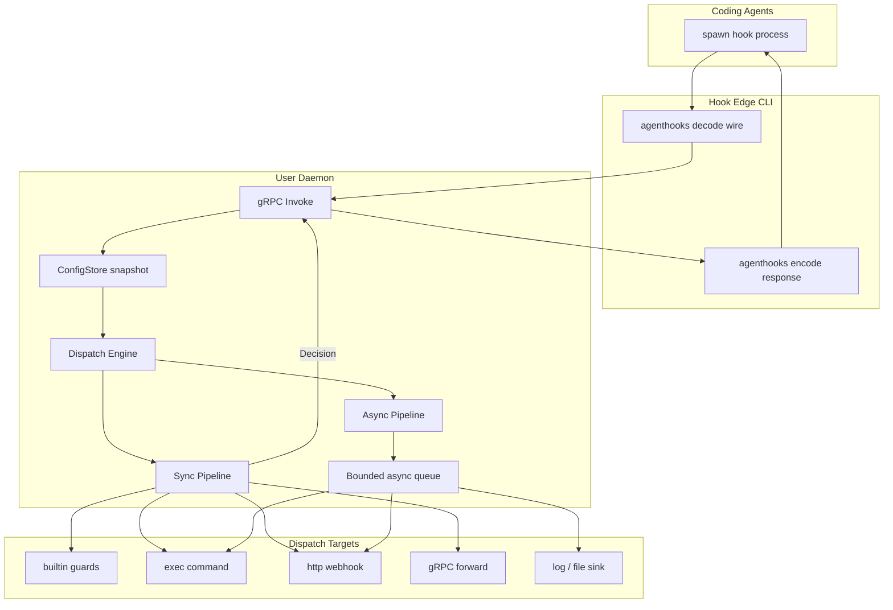
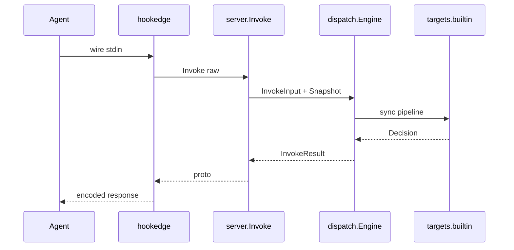

# agentd — Design

User-level daemon: proxy, guard, and observe coding-agent hooks (Claude Code, Cursor, Codex, Gemini CLI, OpenCode, Kimi Code). Built on [agenthooks](https://github.com/speakeasy-api/agenthooks).

Contributor rules: [AGENTS.md](./AGENTS.md) · Code style: [CONVENTIONS.md](./CONVENTIONS.md) · Session handoff: [PROGRESS.md](./PROGRESS.md)

> Section numbering keeps historical anchors (§11, §13, §14); removed sections (§9, §10, §12) are gaps — do not renumber.

---

## For agents — where to read

| Task | Start here | User-facing detail |
|------|------------|-------------------|
| Hook hot path / routing / guards | **§1.5** → **§2** | [docs/en/dispatch.md](./docs/en/dispatch.md) |
| Config merge / reload / YAML keys | **§3** → **§7** | [docs/en/configuration.md](./docs/en/configuration.md) |
| CLI flags / commands | **§6** (architecture only) | [docs/en/cli.md](./docs/en/cli.md) (canonical) |
| gRPC / proto contracts | **§4** | `api/agentd/v1/*.proto` |
| Package ownership / boundaries | [AGENTS.md § Architecture](./AGENTS.md#architecture) | — |
| Trajectory / session ledger | **§14** | [docs/en/trajectory.md](./docs/en/trajectory.md) |
| Provider quirks (hook wire) | **§14.3** matrix + [docs/en/providers.md](./docs/en/providers.md) | `providers-*.md` |
| Intent note hot path tag | **§1.5** (`invoke_sync` \| `config_reload` \| `async_side` \| `other`) | — |
| Milestone history / acceptance | [PROGRESS.md](./PROGRESS.md) | — |

**Invariants agents must preserve:** hook CLI decode/encode only (no policy); `Store.Current()` on Invoke (no disk I/O); async/trajectory never block sync wire; `Engine` must not switch on target kind (use `targets` factory); preserve `Event.Raw` verbatim; never log to hook stdout.

---

## 0. Goals

| Goal | Approach |
|------|----------|
| One hook logic, all agents | Thin CLI + agenthooks wire; daemon owns policy |
| Low latency on hot path | In-memory config snapshot; zero disk I/O per `Invoke` |
| Sync + async hooks | Dispatch Engine with hybrid modes |
| Safe defaults | Declarative guards; fail-closed policy option |
| Cross-platform | gRPC **IPC** (inter-process communication) over Unix socket / Windows named pipe |
| Cross-agent trajectory | Append-only session ledger (default on) — §14 |

**Decisions:** one daemon per user; declarative YAML guards/dispatch; daemon writes runtime overlay only; trajectory is async side channel (default on; `redact_secret_rules` default true, PII).

---

## 1. Architecture



| Process | Role | Lifecycle |
|---------|------|-----------|
| **Daemon** | gRPC, Dispatch, guards, ConfigStore, async queue | One per user |
| **Hook edge** (Hook CLI) | Wire decode/encode; single gRPC `Invoke` | Process-per-event |
| **Mgmt CLI** | start/stop/status/install/config/doctor/setup | Short-lived |

### agenthooks integration

| Surface | Command | Notes |
|---------|---------|-------|
| Public hook CLI | `agentd hook run\|notify\|serve --provider=…` | Docs + manual setup |
| Install sentinel | `agentd agenthooks …` (hidden) | `agenthooks/install` appends this to generated configs |
| Install | `agentd install --provider=P --scope=S` or `--all-detected` | `Command` = absolute `agentd` path; library appends `agenthooks run\|serve\|notify`; `--all-detected` writes only with `--yes` |

Both `hook` and `agenthooks` wrap the same hook-edge path (`cmd/hook.go`, package `internal/hookedge`). Daemon owns `*agenthooks.Runner` for `builtin` sync targets; guards → sync, observers → async `observe: true`. OpenCode: `hook serve` holds stdio; **NDJSON** (newline-delimited JSON) frames → `Invoke`; session mutex in daemon.

**Providers:** `claude-code`, `cursor`, `codex`, `gemini`, `opencode`, `kimi-code` (+ variants). Canonical ids: `internal/provider`.

---

## 1.5 Hot paths

Three traces for reading code and reviewing PRs. Tag intent notes with one of these.

### invoke_sync

Blocking hook: agent waits for decision before continuing.



Flow: `hook run|serve` → hookedge decode → `HookService.Invoke` → `dispatch.Engine.Invoke` + `config.Snapshot` from `Store.Current()` → route match → sync targets folded with `first_conclusive` (`Runner.Decide` on builtin) → encode.

`fail_closed` denies on guard/dispatch errors via `policy.fail` in `dispatch.Engine.Invoke` after sync pipeline failure (timeout/cancel from grpc targets; guard panics). Decode errors remain neutral at the server boundary. Sync budget: `dispatch.SyncBudget` (`timeout.go`) — must fit provider hook timeout.

On Dial/Invoke failure only, hookedge may read disk via `config.OfflineFor` to apply `policy.offline` (live Invoke path stays Store.Current-only in the daemon). Hook entrypoints use `hookclient.DialReady` (Dial + Health) because gRPC dial is lazy.

### config_reload

fsnotify on user/project/runtime YAML → debounced reload in `config.Store` → merge → `Compile` → atomic pointer swap. Hot path: `Store.Current()` only. `SIGHUP` / runtime overlay write triggers reload; daemon does not compile config itself.

### async_side

`parallel` / `after_sync` / `async_only` → `Queue.Enqueue` (non-blocking; drops per `on_overflow`) → worker pool → async targets. Sync returns before workers finish; async failure does not change sync decision.

When `trajectory.enabled`, `Invoke` also enqueues ledger records (separate bounded queue; JSONL persist async). Overflow → `trajectory_dropped_count` on Status. When `trajectory.statistics` is on, token extraction may tail-read a provider transcript in the statistics goroutine (Codex `Stop` fallback; not on `invoke_sync`).

### Package tags

| Package | Hot path | Role |
|---------|----------|------|
| `internal/hookedge` | `invoke_sync` | Provider codecs + wire I/O |
| `internal/server` | `invoke_sync` | Thin gRPC mapping to Engine / Snapshot |
| `internal/dispatch` | `invoke_sync`, `async_side` | Route match, Engine, queue, session lock |
| `internal/dispatch/targets` | `invoke_sync`, `async_side` | Sync/Async target adapters via factory |
| `internal/decision` | `invoke_sync` | proto↔agenthooks Decision |
| `internal/guard` | `invoke_sync` | secrets/shell/mcp/paths checks |
| `internal/metrics` | `other` | Prometheus registry, runtime gauges, invoke/async histograms (leaf; no dispatch import) |
| `internal/config` | `config_reload` | Merge/compile; hot path reads Snapshot only |
| `internal/trajectory` | `async_side` | Session ledger append, persist, Hub, replay/fork |
| `internal/provider` | `other` | Canonical ids; Invoke uses `FromProto`, CLI uses `Parse` |
| `internal/daemon` | `other` | start/stop, lock, status, reload signal |
| `internal/transport` | `other` | Unix socket / named pipe I/O |
| `internal/hookclient` | `invoke_sync` | gRPC client to daemon |
| `internal/install` | `other` | Discover, Plan, doctor report, hook install via agenthooks |
| `internal/install/tui` | `other` | Setup wizard; `install` must not import this package |

**Ownership rules:** Kind→impl mapping only in `targets` factory — not in `Engine`. Guard attach only via `guard.AttachCheckers` wired from `targets/builtin`. HookService ports (`Invoker`, `SnapshotSource`) in `server/invoke.go`.

---

## 2. Hook Dispatch Engine

Central router: **sync pipeline** (agent response; must fit provider timeout) + **async pipeline** (audit/metrics; never blocks wire).

### Dispatch modes

| Mode | Behavior | Use when |
|------|----------|----------|
| `sync_only` | Sync → decision → encode | Blocking hooks |
| `async_only` | No decision; async only; no-op wire | Telemetry, notify |
| `parallel` | Sync + async together; async does not block | Guard + audit |
| `after_sync` / `sync_then_async` | Async after sync with outcome | Default hybrid |

**Defaults by kind** (override in config):

```yaml
dispatch_defaults:
  tool.pre:         { mode: parallel,        blocking: true }
  prompt.submitted: { mode: sync_only,        blocking: true }
  agent.stop:       { mode: sync_then_async, blocking: true }
  tool.post:        { mode: parallel,        blocking: false }
  notification:     { mode: async_only,      blocking: false }
  other:            { mode: async_only,      blocking: false }
```

Wire kind names (`tool.pre`, `prompt.submitted`, `agent.stop`, `tool.post`, `notification`, `other`): [docs/en/dispatch.md § Event kinds](./docs/en/dispatch.md#event-kinds-kind) · [glossary](./docs/en/glossary.md).

### Routes

Routes evaluated top-down; first match wins. Example:

```yaml
dispatch:
  - name: gate-and-audit
    match: { kind: [tool.pre], provider: ["*"], tools: [Shell, MCP] }
    mode: parallel
    sync:
      - target: builtin
        guards: [secrets, shell]
      - target: grpc
        endpoint: unix:///path/to/other.sock
        timeout: 2s
        merge: first_conclusive
        on_error: fail_closed
    async:
      - target: log
        level: info
      - target: http
        url: https://audit.internal/hooks
        retry: 0
```

### Target types

| Target | Sync | Async | Payload |
|--------|------|-------|---------|
| `builtin` | `Runner.Decide` / guards | `OnAny` observe | `Event` + `Raw` |
| `exec` | — (v1 async-only) | detached spawn | stdin = raw |
| `http` | POST + parse body | fire-and-forget POST | JSON envelope |
| `grpc` | forward `Invoke` | unary async | proto |
| `log` / `file` | — | structured log / JSONL | metadata |

**Sync merge:** list-level `first_conclusive` implemented (`FirstConclusive` + `runSync` fold). `all_restrictive` / `sequential_neutral_merge` — DESIGN names only, not implemented.

### Provider-aware dispatch

| Concern | Behavior |
|---------|----------|
| Timeout | `min(provider_timeout - margin, route.sync_timeout)` |
| Codex empty stdout | explicit no-op when all neutral |
| Gemini stderr | hookedge never logs to stderr |
| Cursor telemetry | async failure never changes sync decision |
| OpenCode | per-session queue for sync and async |

### Async queue

Bounded channel (default 1024); overflow → drop + Status metric. Per-target timeout (default 30s); `context.WithoutCancel` for workers. Shutdown: drain with cap or drop + log.

More examples: [docs/en/dispatch.md](./docs/en/dispatch.md).

---

## 3. ConfigStore

### Layers (low → high precedence)

| Layer | Path | Writer |
|-------|------|--------|
| defaults | in code | developers |
| user | `~/.agentd.yaml` | user / CLI |
| project | `.agentd.yaml` (nearest ancestor of CWD) | user / CLI |
| runtime | `$XDG_STATE_HOME/agentd/runtime.yaml` | **daemon only** (why + unset fallback + Windows: [docs/en/configuration.md](./docs/en/configuration.md#state-directory)) |

Merge: `defaults ⊕ user ⊕ project(cwd) ⊕ runtime`. Project config is cached in `Store` under `projectsMu` (RLock on cache hit); first load walks ancestors of CWD once, then hot path uses the cached snapshot.

**User bootstrap:** `daemon start` calls `PrepareUserConfig` once before load. Missing `~/.agentd.yaml` (or `--config`) gets a minimal file; invalid user YAML/compile blocks start with stderr notice. `Load` / `config show` / `config validate` never create the user file. Details: [docs/en/configuration.md](./docs/en/configuration.md#user-config-bootstrap).

### Hot path — zero config I/O

```go
func (s *Store) Current() *Snapshot { return s.snap.Load() }
```

`Invoke` never calls `ReadFile`, `fsnotify`, or `viper.ReadInConfig` on the hot path.

### Reload

| Trigger | Mechanism | Debounce |
|---------|-----------|----------|
| User/project file changed | fsnotify | 200–500 ms |
| Daemon patch / approval | in-memory merge → swap | immediate |
| Runtime persist | ignored (self-write via atomic rename) | — |
| `ReloadConfig` / SIGHUP | full re-read | — |

Compile pipeline (single goroutine): `reloadCh → load → merge → validate → compile → Snapshot → atomic.Store`.

**Fingerprint:** `sha256(canonical_json(merged_config))` + monotonic `generation` on Status.

---

## 4. gRPC API

Protobuf: `api/agentd/v1/`. Buf rules: [AGENTS.md § Protobuf](./AGENTS.md#protobuf).

| Service | RPC | Purpose |
|---------|-----|---------|
| **HookService** | `Invoke` | Hot path: sync + async orchestration |
| **DaemonService** | `Health`, `Status`, `ReloadConfig`, `Shutdown` | Liveness, ops, graceful stop |
| **ConfigService** | `GetConfig`, `PatchConfig`, `RecordDecision` | Config views, runtime patch, Ask approvals |
| **SessionService** | `Subscribe` | Live trajectory firehose (post-commit) |
| **TrajectoryService** | `Statistics` | Daemon-lifetime rollup (not on hook hot path) |

**InvokeRequest:** `provider`, `variant`, `raw_payload`, `invocation_mode`, `deadline`, `cwd`, `project_root`  
**InvokeResponse:** `decision`, `config_generation`, `async_dispatched_count`  
**SessionEvent:** `schema_version`, `seq`, `type`, `source`, `ts`, `provider`, `session_id`, `data`, `raw`, `ignorable`, …

---

## 5. Transport

| OS | Default |
|----|---------|
| Linux/macOS | `$XDG_RUNTIME_DIR/agentd/agentd.sock` (Unix, `0600`) |
| Windows | `\\.\pipe\agentd-<user-sid>` (named pipe) |

State: socket path in `$XDG_RUNTIME_DIR/agentd/state.json`, PID + lock files. Optional dev: loopback TCP. Implementation: `internal/transport` (`listen_*.go` / `dial_*.go` / `path_*.go`).

**Prometheus metrics HTTP** (opt-in, separate from gRPC IPC): when `metrics.enabled` or `--metrics-listen` is set at daemon start, a loopback TCP server exposes `/metrics` on the compiled listen address (default `127.0.0.1:2112`). Not hot-reloaded — changing `metrics.listen` requires `daemon stop` then `daemon start` (`daemon reload` does not rebind the metrics listener). Status `metrics_listen` reports the bound address after `Listen`. Implementation: `internal/daemon` + `internal/metrics`; Status field `metrics_listen` when running.

**Sync grpc target timeout/cancel:** when the sync budget expires or the request context is canceled (`context.DeadlineExceeded` / `context.Canceled`), `GRPCSync` returns the dial/invoke error to `Engine.Invoke` (metrics `outcome=timeout` or `error`). `Engine.Invoke` then applies `policy.fail` (`fail_closed` → Deny/BlockPrompt when the event supports it; `fail_open` → NoDecision). Other grpc errors with route `on_error: fail_closed` still map to Deny inside `GRPCSync` without failing Invoke.

---

## 6. CLI Reference

**Canonical flags/commands:** [docs/en/cli.md](./docs/en/cli.md) · RU: [docs/ru/cli.md](./docs/ru/cli.md)

CLI families mirror process roles:

```
agentd
├── version          # binary build version (no daemon)
├── daemon/          # lifecycle (start|stop|status|reload|enable|disable)
├── hook/            # agent entrypoint (run|notify|serve)
├── agenthooks/      # hidden install argv sentinel (same as hook *)
├── doctor           # read-only discover + hook status
├── setup            # TUI (text terminal UI) wizard; AGENTD_NO_TUI / CI bypass
├── install          # --provider or --all-detected (plan-only unless --yes)
├── config/          # validate|show|enable|disable|get|patch|record-decision
├── dispatch/        # routes introspection
├── session/         # trajectory list|show|export|search|import|replay|fork|subscribe|stats
└── trajectory/      # trajectory stats (daemon rollup; requires running daemon)
```

**Architecture notes (not duplicated in user docs):**

| Topic | Rule |
|-------|------|
| Persistent flags | `--config`, `--socket`, `-v` — stderr only; **never hook stdout** |
| Hook path | Thin: decode → gRPC `Invoke` → encode; **no guards in CLI** |
| Offline | Daemon down → edge reads local merge for `policy.offline` (default `fail_open`); stderr still prints `daemon not running`; never debug on stdout |
| `version` vs `daemon status` | `version` = this CLI binary; Status `version` = running daemon process |
| `hook notify` | Codex argv JSON; always async semantics |
| `hook serve` | OpenCode NDJSON stdio; long-lived |
| `session subscribe` | Live trajectory stream from daemon; also `trajectory stats` for rollup counters |
| Login autostart | `daemon enable` / `disable` register OS user-level autostart (systemd / launchd / schtasks); `disable` never stops running daemon; partial enable failure keeps autostart — [docs/en/operations.md](./docs/en/operations.md#autostart-at-login) |
| Config toggles | `config enable\|disable\|get` write curated booleans to user/project YAML only; `config patch` is runtime overlay; distinct from `daemon enable` (autostart) |
| Doctor | Read-only Discover+Plan; daemon unreachable is a report field, not an error |
| Setup / TUI | `internal/install/tui`; **TUI** = interactive terminal wizard. `install` must not import `tui` (`cmd/` wires both). Non-TTY / `AGENTD_NO_TUI` / `CI` → `--provider` or `--all-detected` |
| Auto-install | `--all-detected` uses high-confidence findings only; writes require `--yes` |
| New command | Update **docs/en/cli.md + docs/ru/cli.md**; add row here only if architecturally significant |

### CLI `--out` pattern (session commands)

Architecture-only — user examples in [docs/en/cli.md](./docs/en/cli.md). One contract for commands that stream structured data without their default persist side effect (e.g. future `session show --out`).

| Rule | Why |
|------|-----|
| **Flag name `--out`** | Same as `session export --out`; one flag across session family |
| **Values: `-` or file PATH** | POSIX / Docker (`-` = stdout); pipe-friendly |
| **Two command classes** | **Read/export** (`session export`): default = **stdout**. **Mutate/import** (`session import`): default = **on-disk ledger** |
| **`--out` on mutate class** | **Emit-only**: parse and write JSONL; no ledger append, import checkpoint, or Hub publish |
| **`--out` on read class** | Redirect stdout default to file; `-` not needed |
| **Stream contract** | **stdout or file = machine data only** (JSONL). **stderr = summary** (`provider=…` or `--json`) — pipe-safe |
| **`--dry-run` orthogonal** | Summary-only without event bodies; does not imply `--out` |
| **Format** | JSONL identical to ledger / `session export` |
| **Security** | File `--out`: `0o600`, parent dir `0o700` |
| **Future reuse** | New session emit commands SHOULD use `--out` + `trajectory.WriteEvents*` + stderr summary |

---

## 7. Configuration schema

**Canonical YAML reference:** [docs/en/configuration.md](./docs/en/configuration.md)

Four-layer merge (§3). Key top-level sections:

| Section | Purpose |
|---------|---------|
| `policy` | `fail`, `ask_fallback`, `offline` |
| `async` | `queue_capacity`, `worker_limit`, `target_timeout`, `on_overflow` |
| `logging` | daemon log level/file |
| `dispatch_defaults` / `dispatch` | §2 |
| `guards` | `secrets`, `shell`, `mcp`, `paths` |
| `trajectory` | §14 — default on |
| `metrics` | opt-in Prometheus scrape HTTP; default off; `listen` host:port |
| `projects` | per-repo guard overrides |

**Runtime overlay** (`runtime.yaml`, daemon-only):

```yaml
version: 1
approvals:
  secrets:
    - fingerprint: "sha256:abc..."
      scope: project
      project: /path/to/repo
      expires_at: "2026-08-21T12:00:00Z"
blocks:
  temporary:
    - tool: shell
      pattern: "curl * | sh"
      reason: "auto-block after 3 denials"
      until: "2026-08-20T15:00:00Z"
```

Persist: debounced atomic flush (`runtime.yaml.tmp` → `runtime.yaml`). Approval **TTL** (time to live): project-scoped defaults to 24h unless `expires_at` (RFC3339) is set; session-scoped approvals match `--session-id` without wall-clock expiry by default.

---

## 8. Concurrency

- **Sync Invoke:** per-session mutex; parallel across sessions
- **Async / trajectory:** enqueue and return; never blocks sync response
- **Hybrid parallel:** async starts with sync; independent outcomes
- **Hybrid after_sync:** async receives `SyncOutcome`
- **Shutdown:** stop accept → drain sync → drain async (timeout) → close

---

## 11. Non-goals (v1)

- Agent auth/login flows
- Owning the agent loop / Harness-style resume (trajectory replay is **policy-only** — §14.4)
- Go plugin system (YAML targets only)
- Standalone hooks DSL
- Async retry storms (default `retry: 0`)
- Sync `exec` JSON decision (exec async-only in v1)
- OpenTelemetry / Pushgateway / remote-write metrics (Prometheus pull via opt-in loopback `/metrics` only; see §5)

Tests: [CONVENTIONS.md § Tests](./CONVENTIONS.md#tests) · `go test ./... -race` · e2e: `make e2e`

---

## 13. Milestones

| Milestone | Status | Scope |
|-----------|--------|--------|
| M0–M7 | **done** | Daemon through approvals / runtime persist |
| M8 / v0.0.1 | **done** | Ops polish, conformance, release gate |
| M9–M12 / v0.0.2 | **done** | Trajectory P0–P3 (ledger, import, replay/fork, Subscribe) |
| M13 / v0.0.3 | **done** | `policy.offline` hook edge (OfflineFor, DialReady, serve offline cache); `e2e-m13` |
| M14 / v0.0.4 | **done** | `daemon enable`/`disable` login autostart; `config enable`/`disable`/`get` toggles; `e2e-m14` |
| M15 / v0.0.5 | **done** | Trajectory statistics: daemon rollup (`trajectory stats`) + offline `session stats`; `e2e-m15` |
| M16 / v0.0.6 | **done** | Prometheus metrics HTTP; trajectory stats token/delta rollup; `e2e-m16` |
| M17 / v0.0.7 | **done** | `doctor`; `install --all-detected` (plan-only default, `--yes` to apply); discovery + hook status; `e2e-m17` |
| M18 / v0.0.7 | **done** | `setup` TUI wizard; interactive bare `install` on TTY; `AGENTD_NO_TUI` / `CI` bypass; `e2e-m18` |
| M19 / v0.0.8-beta | **done** | Cursor trajectory stats: sum billing tokens per `stop` (per generation), not session delta; wire row in `e2e-m15` (`cursor_two_stops_sum_tokens`) |
| M20 | **done** | Policy/reliability wire coverage: `policy.fail` on daemon path, `ask_fallback`, notify/serve `Cwd`; `e2e-m20` |

**Shipped:** v0.0.8-beta. Session handoff + acceptance archive: [PROGRESS.md](./PROGRESS.md).

---

## 14. Trajectory hub

**Cross-agent session ledger** (default on) — hooks live (L0 for all six providers; tier definitions §14.3); optional transcript importers (L2+) where stable on-disk formats exist. agentd stays **gate + observer outside the agent loop**.

**Product claim:** *Every supported agent's hooks are traceable on one stream; transcript/thinking depth varies by provider (§14.3).*  
**Not claimed:** byte-identical “everything the model sees”; agent-loop resume.

User guide: [docs/en/trajectory.md](./docs/en/trajectory.md)

### 14.1 Hot-path rules

Same as ConfigStore / async_side (§1.5):

- No trajectory disk I/O inside sync `Decide` / encode
- Append in-memory → async JSONL persist
- Overflow: drop + counter; must not stall the agent
- Offline `session import --out` parses transcripts and encodes events via the §6 `--out` pattern; it does not enqueue ledger persist or update import sidecars

**Storage:** `$XDG_STATE_HOME/agentd/sessions/<provider>/<session_id>.jsonl` (why + unset fallback + Windows: [docs/en/configuration.md](./docs/en/configuration.md#state-directory))

### 14.2 Event catalog

Contiguous `seq` per session; `schema_version` **1**; `ignorable` types skippable by readers.

| Type | Source | When |
|------|--------|------|
| `session/open` | `system` | First sighting of session key |
| `hook/invoked` | `hook` | Each `Invoke` |
| `hook/decided` | `decision` | After sync pipeline |
| `async/dispatched` | `hook` | Async jobs enqueued |
| `async/dropped` | `system` | Queue or trajectory overflow |
| `transcript/message` | `transcript` | Importer (M10+) |
| `transcript/thinking` | `transcript` | Importer when vendor provides |
| `session/fork` | `system` | Log fork (M11) |
| `session/end-seed` | `system` | After load/fork seed |

Correlation: `session_id` + `tool_use_id` / call ids when present; else synthetic `(provider, project_root, weak_id)` — never silently merge unrelated runs.

Config keys: `trajectory.enabled`, `statistics`, `include_raw`, `redact_secret_rules`, `max_event_bytes`, `import.<provider>` — see §7 / [configuration.md](./docs/en/configuration.md).

### 14.3 Provider support matrix

Depth is tiered; **do not invent events the wire never carried.**

| Tier | Meaning |
|------|---------|
| **L0 Live** | Every `Invoke` → `hook/invoked` + `hook/decided` — **required for all six** |
| **L1 Correlate** | Stable session / tool ids (quality varies) |
| **L2 Import** | On-disk transcript → `transcript/*` |
| **L3 Thinking** | Only if vendor persists reasoning/system |

| Provider | Entrypoint | L0 | L2 Import | L3 | Limits (document in PR if changing) |
|----------|------------|----|-----------|----|-------------------------------------|
| **Claude Code** | `hook run` | req | **supported** (`~/.claude` JSONL) | often | Thinking not in hooks; PromptSubmitted no Ask |
| **Cursor** | `hook run --argv-payload` | req | **partial** (`--path`) | weak | Tool outputs often absent; async must not alter sync |
| **Codex** | `run` + `notify` | req | **supported** (`~/.codex/sessions`) | partial | No CapAsk; notify async-only; tag `invocation_mode` |
| **Gemini** | `hook run` | req | **none** | unknown | No hookedge stderr; trajectory I/O via daemon only |
| **OpenCode** | `hook serve` | req | **none** | unknown | Session mutex; many observe-only frames |
| **Kimi Code** | `hook run` | req | **none** | unknown | No CapAsk; observe-only kinds still L0-record |

Importer status enum: `supported` | `partial` | `none`. Per-provider hook quirks: [docs/en/providers.md](./docs/en/providers.md).

**Uniform guarantees:** same event catalog/JSONL layout; compile defaults on (`enabled`, `include_raw`, `statistics`); same redaction/`include_raw` controls; missing L2/L3 → no fake `transcript/thinking`; policy replay uses stored `raw` + provider codec (test per fixture).

### 14.4 Terminology

| Term | In agentd | Not in scope |
|------|-----------|--------------|
| **Inspect / search / export / subscribe** | Read or stream ledger | — |
| **Fork** | Copy prefix → new `session_id` | Spawn live agent with context |
| **Replay** | Re-run **policy** (Engine) on stored `raw` | Re-run model / tool loop |
| **Resume** | N/A | Harness-style continue-from-seq |

### 14.5 Non-goals (trajectory)

- Replacing the agent loop
- Default-on full `Raw` **without** redaction (`redact_secret_rules` stays default true)
- Claude-only L0 (all six required)
- Sync-path persistence / blocking wire on flush
- Inventing PostTool results or thinking when provider never emitted them
- Go plugin importers (in-tree + YAML enable flags)

Complementary to async `file`/`http`/`log` sinks — structured ledger with identity, seq, read APIs.

### 14.6 Statistics

Two surfaces, both gated by `trajectory.enabled && trajectory.statistics`:

| Surface | Command | Storage | Notes |
|---------|---------|---------|-------|
| Daemon rollup | `agentd trajectory stats` | In-memory for the daemon process lifetime (resets on stop+start) | gRPC `TrajectoryService.Statistics`; `since` = daemon `StartedAt` |
| Session scan | `agentd session stats ID --provider P` | None (computed) | Offline JSONL scan after config gate |

Token fields: daemon rollup reads Invoke `RawPayload` always; offline `session stats` needs `include_raw` in JSONL. Cursor `stop` billing tokens are per generation (sum each stop). Codex `Stop` falls back to tail-read of rollout transcript (`last_token_usage` from last `token_count` line) when hook raw has no usage. CLI `trajectory stats --json` uses enum names; gRPC wire keeps int map keys. Gemini/OpenCode/Kimi: hooks-only counters in v1 (no token extractors).
