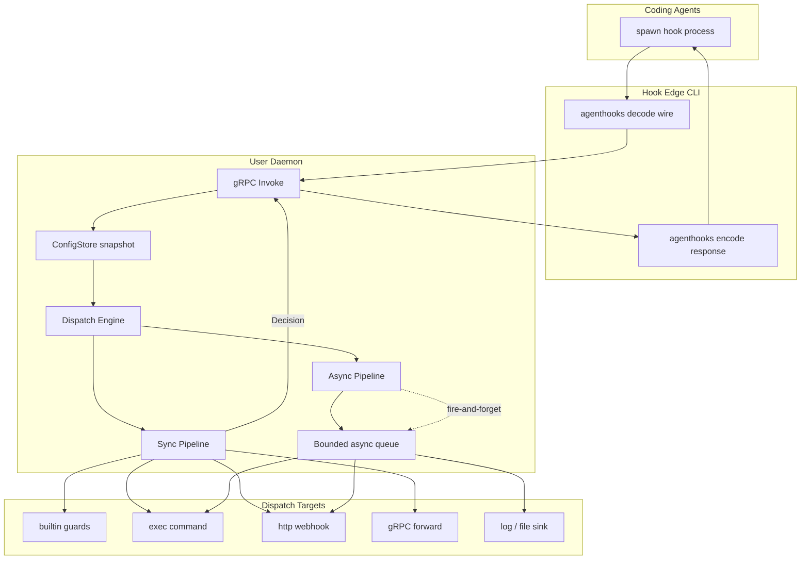

# agentd — Design

A user-level daemon that proxies, guards, and observes coding-agent hooks for Claude Code, Cursor, Codex, Gemini CLI, OpenCode, and Kimi Code. Built on [agenthooks](https://github.com/speakeasy-api/agenthooks).

Contributor and protobuf rules: [AGENTS.md](./AGENTS.md).

---

## 0. Goals

| Goal | Approach |
|------|----------|
| One hook logic, all agents | Thin CLI + agenthooks wire; daemon owns policy |
| Low latency on hot path | In-memory config snapshot; zero disk I/O per `Invoke` |
| Sync + async hooks | Dispatch Engine with hybrid modes |
| Safe defaults | Declarative guards; fail-closed policy option |
| Cross-platform | gRPC over Unix socket / Windows named pipe |

**Decisions:**

- One daemon per user (shared socket; per-project config via `.agentd.yaml`)
- Guards and dispatch via declarative YAML
- Daemon writes runtime overlay only (`$XDG_STATE_HOME/agentd/runtime.yaml`)
- Hook CLI: decode/encode only; all routing in daemon

---

## 1. Architecture



Agents always invoke `agentd hook run|notify|serve`. Hook CLI decode/encodes wire (agenthooks). **Dispatch Engine** routes sync (agent waits), async (telemetry), or hybrid.

### Process roles

| Process | Role | Lifecycle |
|---------|------|-----------|
| **Daemon** | gRPC server, Dispatch, guards, ConfigStore, async queue | One per user |
| **Hook CLI** | Wire decode/encode; single gRPC `Invoke` | Process-per-event |
| **Mgmt CLI** | start/stop/status/install/config | Short-lived |

### agenthooks integration

1. **Hook CLI** mirrors `install.Manifest` argv:
   ```
   agentd hook run --provider=claude-code
   agentd hook run --provider=cursor --argv-payload
   agentd hook notify --provider=codex
   ```
   Install via `github.com/speakeasy-api/agenthooks/install` with `Command: []string{"agentd", "hook", "run", ...}`.

2. **Daemon** owns `*agenthooks.Runner` for `builtin` target:
   - Guards → sync `builtin`
   - Observers → async `builtin` with `observe: true`
   - `Runner.Decide(ctx, typed)` on sync path
   - Forward targets in `internal/dispatch/targets/`

3. **OpenCode** — `agentd hook serve` holds stdio; each NDJSON frame → gRPC `Invoke`; session mutex in daemon.
   Install-generated shims use the agenthooks argv sentinel: `agentd agenthooks serve --provider=opencode`
   (same behavior as `hook serve`).

4. **Providers:** `claude-code`, `cursor`, `codex`, `gemini`, `opencode`, `kimicode` (+ variants).

---

## 2. Hook Dispatch Engine

Central router with two axes:

1. **Sync pipeline** — affects agent response (deny/ask/allow/context); must fit provider timeout.
2. **Async pipeline** — audit, metrics, webhooks; never blocks wire response.

### Dispatch modes

| Mode | Behavior | Use when |
|------|----------|----------|
| `sync_only` | Sync chain → decision → encode | Blocking hooks |
| `async_only` | No decision; async only; no-op wire | Telemetry, notify |
| `parallel` | Sync + async start together; async does not block | Guard + audit |
| `after_sync` | Async after sync decision with outcome | Audit with deny/allow context |
| `sync_then_async` | Alias for `after_sync` | Default hybrid for blocking events |

**Defaults by kind** (override in config):

```yaml
dispatch_defaults:
  tool.pre:         { mode: parallel,        blocking: true }
  prompt.submitted: { mode: sync_only,        blocking: true }
  agent.stop:       { mode: sync_then_async, blocking: true }
  tool.post:        { mode: parallel,        blocking: false }
  notification:     { mode: async_only,      blocking: false }
  other:            { mode: async_only,      blocking: false }
```

### Routes (declarative)

```yaml
dispatch:
  - name: gate-and-audit
    match:
      kind: [tool.pre]
      provider: ["*"]
      tools: [Shell, MCP]
    mode: parallel
    sync:
      - target: builtin
        guards: [secrets, shell]
      - target: grpc
        endpoint: unix:///path/to/other.sock
        timeout: 2s
        merge: first_conclusive
        on_error: fail_closed
    async:
      - target: log
        level: info
      - target: http
        url: https://audit.internal/hooks
        retry: 0

  - name: codex-notify
    match:
      kind: [notification]
      provider: [codex]
    mode: async_only
    async:
      - target: exec
        command: ["my-notifier", "--"]
        stdin: raw

  - name: cursor-telemetry
    match:
      kind: [tool.post, file.edited]
      provider: [cursor]
      blocking: false
    mode: async_only
    async:
      - target: builtin
        observe: true
```

Routes evaluated top-down; first match wins.

### Target types

| Target | Sync | Async | Payload |
|--------|------|-------|---------|
| `builtin` | `Runner.Decide` / guards | `OnAny` observe | `Event` + `Raw` |
| `exec` | spawn, optional JSON decision | detached spawn | stdin = raw |
| `http` | POST + parse body | fire-and-forget POST | JSON envelope |
| `grpc` | forward `Invoke` | unary async | proto |
| `log` | — | structured log | metadata |
| `file` | — | append JSONL | audit |

**Sync merge policies:** `first_conclusive` (Any), `all_restrictive` (All), `sequential_neutral_merge` (context append).

### Provider-aware dispatch

| Concern | Behavior |
|---------|----------|
| Timeout | `min(provider_timeout - margin, route.sync_timeout)` |
| Codex empty stdout | explicit no-op when all neutral |
| Gemini stderr | hookedge never logs to stderr; async → file |
| Cursor telemetry | async failure never changes sync decision |
| OpenCode | per-session queue for sync and async |
| Blocking hook | `install.HookSpec.Blocking` + route `mode` |

### Async queue

```
Invoke → sync pipeline → response to CLI
              ↓
         enqueue async jobs
              ↓
    worker pool (SetLimit N) → InvokeAsync
```

- Bounded channel (default 1024); overflow → drop + metric
- Per-target timeout (default 30s); `context.WithoutCancel` for workers
- Shutdown: drain with cap or drop + log

---

## 3. ConfigStore

### Layers (low → high precedence)

| Layer | Path | Writer |
|-------|------|--------|
| defaults | in code | developers |
| user | `~/.agentd.yaml` | user / CLI |
| project | `.agentd.yaml` (nearest ancestor of CWD) | user / CLI |
| runtime | `$XDG_STATE_HOME/agentd/runtime.yaml` | **daemon only** |

Merge: `defaults ⊕ user ⊕ project(cwd) ⊕ runtime`. Project path resolved once per `Invoke` via pre-built map (no FS walk on hot path).

### Hot path — zero config I/O

```go
type Store struct {
    snap atomic.Pointer[Snapshot]
}

func (s *Store) Current() *Snapshot {
    return s.snap.Load()
}
```

`Invoke` never calls `ReadFile`, `fsnotify`, or `viper.ReadInConfig` on the hot path.

### Reload triggers

| Trigger | Mechanism | Debounce |
|---------|-----------|----------|
| User/project file changed | fsnotify | 200–500 ms |
| Daemon patch / approval | in-memory merge → swap | immediate |
| Runtime persist | ignored (self-write via atomic rename) | — |
| `ReloadConfig` / SIGHUP | full re-read | — |
| Startup | initial load | — |

**Watcher scope:** `~/.agentd.yaml`, runtime overlay, lazy project watches on first `cwd` sighting.

**Compile pipeline (single goroutine):**

```
reloadCh → load → merge → validate → compile routes + guards → Snapshot → atomic.Store
```

### Runtime overlay example

```yaml
version: 1
approvals:
  secrets:
    - fingerprint: "sha256:abc..."
      scope: project
      project: /path/to/repo
      expires_at: "2026-08-21T12:00:00Z"
      granted_by: ask_user
blocks:
  temporary:
    - tool: shell
      pattern: "curl * | sh"
      reason: "auto-block after 3 denials"
      until: "2026-08-20T15:00:00Z"
```

Persist: debounced async flush (500 ms) via `runtime.yaml.tmp` → `runtime.yaml`.

### Fingerprint

- **Current (M5+):** `fingerprint = sha256(canonical_json(merged_config))`
- `generation` — monotonic uint64 on each swap
- Exposed in `DaemonService.Status`

---

## 4. gRPC API

Protobuf definitions: `api/agentd/v1/`. Buf rules: [AGENTS.md § Protobuf](./AGENTS.md#protobuf); details: [CONVENTIONS.md](./CONVENTIONS.md#protobuf--buf).

### HookService

| RPC | Purpose |
|-----|---------|
| `Invoke` | Hot path: sync + async orchestration |

**InvokeRequest:** `provider`, `variant`, `raw_payload`, `invocation_mode`, `deadline`, `cwd`, `project_root`

**InvokeResponse:** `decision`, `config_generation`, `async_dispatched_count`

### DaemonService

| RPC | Purpose |
|-----|---------|
| `Health` | Liveness |
| `Status` | Uptime, generation, fingerprint, sessions, queue depth |
| `ReloadConfig` | Force file re-merge |
| `Shutdown` | Graceful stop |

### ConfigService

| RPC | Purpose |
|-----|---------|
| `GetConfig` | Merged or per-layer view |
| `PatchConfig` | Runtime overlay patch |
| `RecordDecision` | Approval after Ask (e.g. secrets) |

---

## 5. Transport

| OS | Listener | Default |
|----|----------|---------|
| Linux/macOS | Unix domain socket | `$XDG_RUNTIME_DIR/agentd/agentd.sock` |
| Windows | Named pipe (`go-winio`) | `\\.\pipe\agentd-<user-sid>` |

- No TLS on localhost IPC; permissions `0600` / pipe ACL
- Optional dev fallback: loopback TCP
- State: socket path in `$XDG_RUNTIME_DIR/agentd/state.json`, PID file, lock file

Implementation: `internal/transport` with `listen_*.go` / `dial_*.go` / `path_*.go` platform files (`_unix` / `_windows` / `_other`).

---

## 6. CLI Reference

CLI families mirror process roles:

```
agentd
├── daemon/      # lifecycle
├── hook/        # agent entrypoint
├── agenthooks/  # Hidden install argv sentinel (same as hook *)
├── install/     # agenthooks install wrapper
├── config/      # config ops
└── dispatch/    # route introspection
```

**Persistent flags:** `--config`, `--socket`, `-v` (stderr only; never hook stdout).

### `agentd daemon start [--foreground]`

Start the user-level daemon (gRPC, ConfigStore, Dispatch, async queue).

- Detach by default (like agenthooks `detach_*`); `--foreground` for dev/systemd
- Detached start returns only after Health succeeds (or a readiness timeout / error)
- Lock file prevents double start; stale socket/PID cleanup runs only under the lock
- Does not handle hook events

**See also:** `daemon stop`, `daemon status`

**Example:**

```bash
agentd daemon start
agentd daemon start --foreground
```

### `agentd daemon stop [--timeout 10s]`

Graceful shutdown: drain sync `Invoke`, async queue, remove socket/PID.

- Prefers gRPC `Shutdown`; SIGTERM fallback
- `--timeout` avoids hanging on stuck hooks

**See also:** `daemon start`

### `agentd daemon status [--json]`

Runtime state: uptime, config generation, fingerprint, routes, queue depth.

- `--json` for CI/scripts
- Not the same as `config show` (declarative vs runtime)

**Example:**

```bash
agentd daemon status --json
```

### `agentd daemon reload`

Force config re-merge from disk (SIGHUP alias). Rare — fsnotify handles most cases.

**See also:** `config patch` (runtime in-memory only)

### `agentd hook run --provider=PROVIDER [--argv-payload] [--timeout]`

**Primary agent entrypoint.** stdin-mode hooks for Claude, Cursor, Codex, Gemini, Kimi.

- Mirrors agenthooks argv contract; `--provider` required (flag-first)
- Thin: stdin → gRPC `Invoke` → encode stdout + exit code
- No guards in CLI

**See also:** `install`, `hook notify`, `hook serve`

**Example:**

```bash
agentd hook run --provider=claude-code
agentd hook run --provider=cursor --argv-payload
```

### `agentd hook notify --provider=codex`

Codex notify path (argv JSON, not stdin). Always async semantics.

**See also:** `hook run`

**Example:**

```bash
agentd hook notify --provider=codex '{"type":"agent-turn-complete"}'
```

### `agentd hook serve --provider=opencode`

Long-lived NDJSON stdio for OpenCode shim; frames → gRPC `Invoke`.

Install may also invoke the hidden sentinel `agentd agenthooks serve --provider=opencode`.

**See also:** `hook run`, DESIGN § OpenCode

### `agentd install --provider=P --scope=S [--dir PATH]`

Write provider hook configs via `agenthooks/install`. `Command` = absolute path to the
`agentd` binary; generated configs append `agenthooks run|serve --provider=…`.

**See also:** `hook run`

**Example:**

```bash
agentd install --provider=claude-code --scope=project
agentd install --provider=opencode --scope=project --dir /path/to/repo
```
### `agentd config validate [--config PATH] [--cwd PATH]`

Validate YAML offline (CI). Parse + schema + dry-compile routes. Optional `--cwd` merges project `.agentd.yaml`. No daemon required.

### `agentd config show [--merged] [--layer user|project|runtime] [--cwd PATH]`

Inspect config layers or merged effective config (offline).

### `agentd config patch --file DELTA.yaml`

Patch runtime overlay via gRPC (`ConfigService.PatchConfig`). Persists to
`$XDG_STATE_HOME/agentd/runtime.yaml` (debounced atomic flush).

### `agentd config record-decision --fingerprint FP --scope project|session [--project-root PATH] [--session-id ID] [--expires-at RFC3339]`

Record an approval after Ask (`ConfigService.RecordDecision`). Project scope
defaults to 24h TTL; session scope matches `--session-id` until cleared.
Fingerprint comes from the Ask `system_message` (`approval_fingerprint=…`).

### `agentd dispatch routes [--json] [--cwd PATH]`

Show compiled dispatch routes (mode, targets, match order). Debug/ops only.

Compiles defaults ⊕ user ⊕ optional project offline (no daemon required). Named `dispatch:`
routes appear before default-kind fallbacks; target kinds are listed for sync/async.

**Hook failure modes:** daemon down → `policy.offline`; timeout → per `policy.fail`; never debug on stdout.

---

## 7. Configuration schema

```yaml
version: 1

policy:
  fail: fail_closed          # fail_open | fail_closed
  unsupported: degrade       # degrade | strict
  ask_fallback: deny         # deny | no_decision
  offline: fail_closed       # when daemon unreachable

async:
  queue_capacity: 1024
  worker_limit: 8
  target_timeout: 30s
  on_overflow: drop          # drop | log

dispatch_defaults:
  tool.pre: { mode: parallel, blocking: true }
  # ...

dispatch:
  - name: gate-and-audit
    match:
      kind: [tool.pre]
      provider: ["*"]
    mode: parallel
    sync:
      - target: builtin
        guards: [secrets, shell]
    async:
      - target: log
        level: info

guards:
  secrets:
    enabled: true
    action: ask              # ask | deny
    rules: [aws_key, github_pat]
  shell:
    enabled: true
    deny_patterns: ["rm -rf /", "mkfs."]
    ask_on: [curl, wget, ssh]
  mcp:
    enabled: true
    deny_servers: ["untrusted-*"]
  paths:
    enabled: true
    deny_read: ["/etc/shadow"]
    deny_write: ["**/.env"]

projects:
  /path/to/repo:
    guards:
      shell:
        enabled: false
```

---

## 8. Concurrency

- **Sync Invoke:** per-session mutex; parallel across sessions
- **Async:** enqueue and return; never blocks sync response
- **Hybrid parallel:** async starts with sync; independent outcomes
- **Hybrid after_sync:** async receives `SyncOutcome`
- **Shutdown:** stop accept → drain sync → drain async (timeout) → close

---

## 9. Package layout

```
agentd/
├── main.go
├── cmd/
├── api/agentd/v1/
├── gen/
├── internal/
│   ├── daemon/
│   ├── server/
│   ├── dispatch/
│   │   └── targets/
│   ├── hookclient/
│   ├── hookedge/
│   ├── install/
│   ├── guard/
│   ├── config/
│   └── transport/
├── DESIGN.md
├── AGENTS.md
├── PROGRESS.md
└── CONVENTIONS.md
```

---

## 10. Testing

- Unit tests: `package foo_test` only; table-driven ([Go Wiki](https://go.dev/wiki/TableDrivenTests)); full rules in [CONVENTIONS.md](./CONVENTIONS.md#testing)
- Integration: bufconn / in-memory socket; hook CLI round-trip
- Conformance: `agenthooks/agenthookstest` fixtures
- `go test ./... -race`
- Integration e2e: `//go:build integration`

---

## 11. Non-goals (v1)

- Auth/login flows for agents
- Transcript pipelines
- Go plugin system (YAML targets only)
- Standalone hooks DSL
- Async retry storms (default `retry: 0`)

---

## 12. Open questions

1. Typed `Decision` in proto + hookedge encode — **accepted**
2. Approval TTL: project 24h, session until end — **accepted** (v1; see M7)
3. Async overflow: drop + counter in `DaemonService.Status` — **accepted** (v1; see M8)
4. Runtime format: YAML, atomic rename — **accepted**
5. `exec` sync JSON decision — **deferred post-v1**; v1 keeps exec async-only (sync path stays builtin/http/grpc)

---

## 13. Milestones

| Milestone | Status | Scope |
|-----------|--------|--------|
| **M0** | done | Docs (README, DESIGN, AGENTS), proto (`api/agentd/v1`), CLI/internal scaffold |
| **M1** | done | daemon start/stop/status/reload; ConfigStore (defaults⊕user, atomic snapshot); HookService.Invoke → NO_DECISION; `hook run` via daemon; user-facing CLI help |
| **M2** | done | Dispatch Engine; parallel/after_sync; async queue; secrets guard |
| **M3** | done | Forward targets (exec, http, log, file); full dispatch YAML; fsnotify reload |
| **M4** | done | gRPC forward; OpenCode serve bridge; install wrapper; Windows npipe hardening |
| **M5** | done | Config layers (project + runtime); ConfigService; config CLI; merged fingerprint |
| **M6** | done | Guards: shell, mcp, paths |
| **M7** | done | Approvals / `RecordDecision`; runtime persist; temporary blocks |
| **M8 / v1** | planned | Ops polish, conformance, docs freeze, release gate |

Session checklists and verify commands: [PROGRESS.md](./PROGRESS.md).

### Done (M0–M7)

M1 acceptance: `daemon start|status|reload|stop` and `hook run --provider=…` round-trip.

M2 acceptance: Dispatch Engine (parallel/after_sync), bounded async queue, secrets guard Ask/Deny on tool.pre, `dispatch routes`, `scripts/e2e-m2.sh`.

M3 acceptance: declarative `dispatch:` + async exec/http/log/file; debounced fsnotify reload; `scripts/e2e-m3.sh`.

M4 acceptance: declarative `target: grpc` (sync+async); `hook serve` / `hook notify` + agenthooks sentinel; `agentd install`; Windows pipe path by SID; `scripts/e2e-m4.sh`.

M5 acceptance: four-layer merge; ConfigService Get/Patch; `config validate|show|patch`; merged fingerprint; project-aware Invoke; `scripts/e2e-m5.sh`.

M6 acceptance: declarative `guards.shell` / `mcp` / `paths`; Ask/Deny honor policy + provider caps; route `guards: [...]` subset; `scripts/e2e-m6.sh`.

M7 acceptance: Approve once → subsequent matching tool.pre allows within TTL; restart daemon reloads approvals; expired entries gone from effective config; `scripts/e2e-m7.sh`.

### M8 — v1 gate

**Goal:** Ship a coherent v1: advertised features work, docs match code, releaseable.

| Phase | Work |
|-------|------|
| A | Async overflow: `on_overflow: drop` + expose drop counter (and queue depth) on `Status` |
| B | Provider timeout margin polish (`min(provider_timeout - margin, route.sync_timeout)`) where still soft |
| C | Conformance: selected `agenthooks/agenthookstest` fixtures on hookedge encode/decode |
| D | Integration tests `//go:build integration` for daemon↔hook round-trip (optional CI job) |
| E | Docs freeze: README features ↔ implemented; DESIGN §7/§6 accurate; remove oversell |
| F | Release: tagged version, `goreleaser` or GH Actions binaries (linux/darwin/windows), changelog |
| G | `scripts/e2e-v1.sh` (or compose m5–m7) + full `make lint` + `make test` |

**v1 exit criteria:**

- [ ] Four-layer config merge + ConfigService Get/Patch/RecordDecision
- [ ] Guards: secrets, shell, mcp, paths
- [ ] Sync+async dispatch + all target kinds from DESIGN §2 (exec remains async-only)
- [ ] Install + hook run/notify/serve for supported providers
- [ ] Cross-platform IPC (unix + Windows SID pipe)
- [ ] No CLI `not implemented` on documented commands
- [ ] README/DESIGN match behavior; non-goals §11 unchanged
- [ ] Lint + race tests + e2e-v1 green; release artifact published

**Explicitly not v1** (see §11 + §12.5): agent auth, transcripts, plugins, hooks DSL, async retry storms, exec sync JSON decisions.
